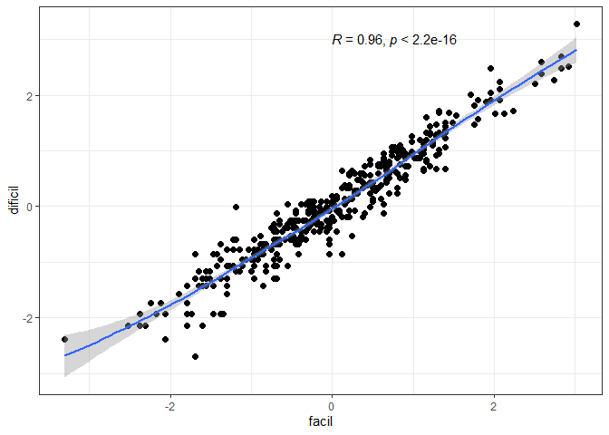

Análisis de propiedad de invarianza en modelos de Rasch
================

# Propiedad de invarianza:

¿Qué es medir en psicología? Para intentar contestar esta pregunta deberíamos ver qué propiedades tiene la medición:

**Sistema intervalar:** sistema de asignación de números que contiene una unidad de medida y el 0 es arbitrario. Podemos pensar este sistema como una escala o línea, en la que podemos ubicar una propiedad de un objeto. En este caso ya hablamos de medición pues se preserva una característica fundamental, que es la constancia de las diferencias de unidades en la escala. La diferencia entre 1 y 3 es igual a la diferencia de 3 y 5. Esto ocurre con, por ejemplo, la medida de temperatura, en que la diferencia entre 5 y 10 grados es igual a la de 10 y 15, para la variable de interés. Sin embargo, en este tipo de mecanismo de asignación de números, no son aplicables las razones (dividir un número por otro), de modo que no es posible decir que 20 grados es el doble que 10 grados. Esto es porque el 0 es arbitrario, y no indica ausencia del atributo. Como veremos, esta característica es exclusiva del modelo de Rasch, y lo distingue de otros modelos IRT (2PL y 3 PL).

**Independencia:** la otra característica de la medición, relacionada a lo anterior, es que la propiedad medida es independiente al objeto usado para su medición. La ubicación en la escala de la propiedad (atributo) de un objeto (de una persona) no depende del instrumento utilizado, sino que es independiente de este. Así, se puede demostrar que es posible dar la misma ubicación en la escala a una persona utilizando distintos instrumentos, siempre y cuando estos instrumentos estén calibrados en la misma escala (estén midiendo el mismo constructo). Del mismo modo, la distancia entre dos ítems (elementos de la escala) no depende del atributo de las personas que se utilisen para establecer esta distancia o diferencia. Dos ítems están a dos logits de distancia, para cualquier persona medida o grupo utilizado para establecer esta distancia. La invarianza, concepto utilizado para referirse a esta propiedad, señala que: "los parámetros son idénticos en poblaciones separadas de examinados, o en condiciones de medición diferentes, y esta propiedad es investigada a través de la comparación de la calibración (estimación de parámetros) en dos o más muestras diferentes" (Rupp & Zumbo, 2006).

**Linealidad:** debe poder expresarse en una línea que indica la ubicación del objeto medido.

**Significado:** debe entregar un significado. ¿en qué sentido una persona tiene más de un atributo que otra persona? En el modelo de Rasch (e IRT) este significado es la probabilidad de obtener una respuesta dada (condicional a) la ubicación del atributo y de la ubicación del ítem.

**Generalizable:** debe poder ser usado para decir algo respecto a cómo se comportará una persona, dada su ubicación en la escala, respecto a otros instrumentos o ítems.

Veamos cómo el modelo de Rasch permite medir y en qué sentido la TCT no permite hacer medición propiamente tal, y que el modelo de Rasch lo logra.

# Modelo de Rasch

Un modelo estadístico permite explicar el proceso que genera los datos observados, utilizando distribuciones de probabilidad y parámetros. Podría pensarse que las observaciones empíricas son producidas por un proceso que desconocemos, una caja negra. Parte fundamental de la labor en ciencias es preguntatse por el mecanismo que produce los datos observados, y ahí entran en juego las probabilidades y la estadística. En el modelo de Rasch tenemos los siguientes elementos fundamentales:

*Y*<sub>*i**j*</sub> ∼ *B**e**r**n*(*p*)
 Donde:

$$ p = \\textstyle\\frac{e^{b\_i-d\_j} }{1+e^{b\_i-d\_j}}\\ $$
 O:

$$ p = \\frac{1}{1+e^{-(b\_i-d\_j)}} $$

Las respuestas de una persona a un ítem son generadas por una distribución de Bernulli, cuya probabilidad se estima a partir de un parámetro que caracteriza a la persona, y un parámetro que caracteriza al ítem.

## Propiedad fundamental del modelo: la invarianza.

Dado un nivel de habilidad, el modelo de Rasch (y el IRT) permite estimar ese nivel de habilidad usando distintos ítems, debido a que considera la dificultad (y la discriminación) o ubicación de los ítems al hacer la estimación de la habilidad (estimación de la ubicación del atributo en una escala). Así, no es lo mismo para estimar la habilidad contestar ítems fáciles que difíciles, y puede ser que, por ejemplo, contestar 4 ítems difíciles sea equivalente a contestar 12 fáciles. Para ello se debe estimar la habilidad considerando la ubicación de los ítems.

¿Para qué sirve esto?

Sirve para estimar la habilidad usando distintos ítems, incluso si estos no son versiones paralelas. También permite estimar habilidades de forma equivalente (bajo una misma escala) pero usando un número diferente de ítems. Veamos un ejemplo:

Supongamos que las personas contestan dos formas de una pruena, pero una es fácil y otra difícil:

``` r
set.seed(10)
n=30
a1 = matrix(rep(1, n),ncol=1)
d1 = matrix(rnorm(n, 0, 1),ncol=1)
d2 = matrix(rnorm(n, -2,1), ncol=1)
thet = matrix(rnorm(400, 0, 1), ncol=1)
```

``` r
prueba_facil=simdata(Theta = thet, a=a1, d=d1, itemtype = "2PL")
prueba_dificil=simdata(Theta = thet, a=a1, d=d2, itemtype = "2PL")
```

### Análisis inicial de los datos:

Lo que primero haríamos al enfrentar estos datos es visualizar y describir lo que estamos observando.

``` r
sjPlot::sjt.itemanalysis(prueba_facil)
```

<table style="border-collapse:collapse; border:none;">
<caption style="font-weight: bold; text-align:left;">
Component 1
</caption>
<tr>
<th style="border-top: double; text-align:center; font-style:italic; font-weight:normal; padding:0.2cm; border-bottom:1px solid black; text-align:left;text-align:left; ">
Row
</th>
<th style="border-top: double; text-align:center; font-style:italic; font-weight:normal; padding:0.2cm; border-bottom:1px solid black; ">
Missings
</th>
<th style="border-top: double; text-align:center; font-style:italic; font-weight:normal; padding:0.2cm; border-bottom:1px solid black; ">
Mean
</th>
<th style="border-top: double; text-align:center; font-style:italic; font-weight:normal; padding:0.2cm; border-bottom:1px solid black; ">
SD
</th>
<th style="border-top: double; text-align:center; font-style:italic; font-weight:normal; padding:0.2cm; border-bottom:1px solid black; ">
Skew
</th>
<th style="border-top: double; text-align:center; font-style:italic; font-weight:normal; padding:0.2cm; border-bottom:1px solid black; ">
Item Difficulty
</th>
<th style="border-top: double; text-align:center; font-style:italic; font-weight:normal; padding:0.2cm; border-bottom:1px solid black; col7">
Item Discrimination
</th>
<th style="border-top: double; text-align:center; font-style:italic; font-weight:normal; padding:0.2cm; border-bottom:1px solid black; col8">
α if deleted
</th>
</tr>
<tr>
<td style=" padding:0.2cm; text-align:left; vertical-align:top; text-align:left;text-align:left; ">
Item\_1
</td>
<td style=" padding:0.2cm; text-align:left; vertical-align:top; text-align:center; ">
0.00 %
</td>
<td style=" padding:0.2cm; text-align:left; vertical-align:top; text-align:center; ">
0.49
</td>
<td style=" padding:0.2cm; text-align:left; vertical-align:top; text-align:center; ">
0.5
</td>
<td style=" padding:0.2cm; text-align:left; vertical-align:top; text-align:center; ">
0.05
</td>
<td style=" padding:0.2cm; text-align:left; vertical-align:top; text-align:center; ">
0.49
</td>
<td style=" padding:0.2cm; text-align:left; vertical-align:top; text-align:center; col7">
0.41
</td>
<td style=" padding:0.2cm; text-align:left; vertical-align:top; text-align:center; col8">
0.85
</td>
</tr>
<tr>
<td style=" padding:0.2cm; text-align:left; vertical-align:top; text-align:left;text-align:left; background-color:#f2f2f2; ">
Item\_2
</td>
<td style=" padding:0.2cm; text-align:left; vertical-align:top; text-align:center; background-color:#f2f2f2; ">
0.00 %
</td>
<td style=" padding:0.2cm; text-align:left; vertical-align:top; text-align:center; background-color:#f2f2f2; ">
0.44
</td>
<td style=" padding:0.2cm; text-align:left; vertical-align:top; text-align:center; background-color:#f2f2f2; ">
0.5
</td>
<td style=" padding:0.2cm; text-align:left; vertical-align:top; text-align:center; background-color:#f2f2f2; ">
0.24
</td>
<td style=" padding:0.2cm; text-align:left; vertical-align:top; text-align:center; background-color:#f2f2f2; ">
0.44
</td>
<td style=" padding:0.2cm; text-align:left; vertical-align:top; text-align:center; background-color:#f2f2f2; col7">
0.42
</td>
<td style=" padding:0.2cm; text-align:left; vertical-align:top; text-align:center; background-color:#f2f2f2; col8">
0.85
</td>
</tr>
<tr>
<td style=" padding:0.2cm; text-align:left; vertical-align:top; text-align:left;text-align:left; ">
Item\_3
</td>
<td style=" padding:0.2cm; text-align:left; vertical-align:top; text-align:center; ">
0.00 %
</td>
<td style=" padding:0.2cm; text-align:left; vertical-align:top; text-align:center; ">
0.28
</td>
<td style=" padding:0.2cm; text-align:left; vertical-align:top; text-align:center; ">
0.45
</td>
<td style=" padding:0.2cm; text-align:left; vertical-align:top; text-align:center; ">
0.98
</td>
<td style=" padding:0.2cm; text-align:left; vertical-align:top; text-align:center; ">
0.28
</td>
<td style=" padding:0.2cm; text-align:left; vertical-align:top; text-align:center; col7">
0.41
</td>
<td style=" padding:0.2cm; text-align:left; vertical-align:top; text-align:center; col8">
0.85
</td>
</tr>
<tr>
<td style=" padding:0.2cm; text-align:left; vertical-align:top; text-align:left;text-align:left; background-color:#f2f2f2; ">
Item\_4
</td>
<td style=" padding:0.2cm; text-align:left; vertical-align:top; text-align:center; background-color:#f2f2f2; ">
0.00 %
</td>
<td style=" padding:0.2cm; text-align:left; vertical-align:top; text-align:center; background-color:#f2f2f2; ">
0.38
</td>
<td style=" padding:0.2cm; text-align:left; vertical-align:top; text-align:center; background-color:#f2f2f2; ">
0.48
</td>
<td style=" padding:0.2cm; text-align:left; vertical-align:top; text-align:center; background-color:#f2f2f2; ">
0.52
</td>
<td style=" padding:0.2cm; text-align:left; vertical-align:top; text-align:center; background-color:#f2f2f2; ">
0.38
</td>
<td style=" padding:0.2cm; text-align:left; vertical-align:top; text-align:center; background-color:#f2f2f2; col7">
0.33
</td>
<td style=" padding:0.2cm; text-align:left; vertical-align:top; text-align:center; background-color:#f2f2f2; col8">
0.85
</td>
</tr>
<tr>
<td style=" padding:0.2cm; text-align:left; vertical-align:top; text-align:left;text-align:left; ">
Item\_5
</td>
<td style=" padding:0.2cm; text-align:left; vertical-align:top; text-align:center; ">
0.00 %
</td>
<td style=" padding:0.2cm; text-align:left; vertical-align:top; text-align:center; ">
0.62
</td>
<td style=" padding:0.2cm; text-align:left; vertical-align:top; text-align:center; ">
0.49
</td>
<td style=" padding:0.2cm; text-align:left; vertical-align:top; text-align:center; ">
-0.47
</td>
<td style=" padding:0.2cm; text-align:left; vertical-align:top; text-align:center; ">
0.62
</td>
<td style=" padding:0.2cm; text-align:left; vertical-align:top; text-align:center; col7">
0.34
</td>
<td style=" padding:0.2cm; text-align:left; vertical-align:top; text-align:center; col8">
0.85
</td>
</tr>
<tr>
<td style=" padding:0.2cm; text-align:left; vertical-align:top; text-align:left;text-align:left; background-color:#f2f2f2; ">
Item\_6
</td>
<td style=" padding:0.2cm; text-align:left; vertical-align:top; text-align:center; background-color:#f2f2f2; ">
0.00 %
</td>
<td style=" padding:0.2cm; text-align:left; vertical-align:top; text-align:center; background-color:#f2f2f2; ">
0.6
</td>
<td style=" padding:0.2cm; text-align:left; vertical-align:top; text-align:center; background-color:#f2f2f2; ">
0.49
</td>
<td style=" padding:0.2cm; text-align:left; vertical-align:top; text-align:center; background-color:#f2f2f2; ">
-0.43
</td>
<td style=" padding:0.2cm; text-align:left; vertical-align:top; text-align:center; background-color:#f2f2f2; ">
0.60
</td>
<td style=" padding:0.2cm; text-align:left; vertical-align:top; text-align:center; background-color:#f2f2f2; col7">
0.36
</td>
<td style=" padding:0.2cm; text-align:left; vertical-align:top; text-align:center; background-color:#f2f2f2; col8">
0.85
</td>
</tr>
<tr>
<td style=" padding:0.2cm; text-align:left; vertical-align:top; text-align:left;text-align:left; ">
Item\_7
</td>
<td style=" padding:0.2cm; text-align:left; vertical-align:top; text-align:center; ">
0.00 %
</td>
<td style=" padding:0.2cm; text-align:left; vertical-align:top; text-align:center; ">
0.28
</td>
<td style=" padding:0.2cm; text-align:left; vertical-align:top; text-align:center; ">
0.45
</td>
<td style=" padding:0.2cm; text-align:left; vertical-align:top; text-align:center; ">
1
</td>
<td style=" padding:0.2cm; text-align:left; vertical-align:top; text-align:center; ">
0.28
</td>
<td style=" padding:0.2cm; text-align:left; vertical-align:top; text-align:center; col7">
0.41
</td>
<td style=" padding:0.2cm; text-align:left; vertical-align:top; text-align:center; col8">
0.85
</td>
</tr>
<tr>
<td style=" padding:0.2cm; text-align:left; vertical-align:top; text-align:left;text-align:left; background-color:#f2f2f2; ">
Item\_8
</td>
<td style=" padding:0.2cm; text-align:left; vertical-align:top; text-align:center; background-color:#f2f2f2; ">
0.00 %
</td>
<td style=" padding:0.2cm; text-align:left; vertical-align:top; text-align:center; background-color:#f2f2f2; ">
0.42
</td>
<td style=" padding:0.2cm; text-align:left; vertical-align:top; text-align:center; background-color:#f2f2f2; ">
0.49
</td>
<td style=" padding:0.2cm; text-align:left; vertical-align:top; text-align:center; background-color:#f2f2f2; ">
0.31
</td>
<td style=" padding:0.2cm; text-align:left; vertical-align:top; text-align:center; background-color:#f2f2f2; ">
0.42
</td>
<td style=" padding:0.2cm; text-align:left; vertical-align:top; text-align:center; background-color:#f2f2f2; col7">
0.41
</td>
<td style=" padding:0.2cm; text-align:left; vertical-align:top; text-align:center; background-color:#f2f2f2; col8">
0.85
</td>
</tr>
<tr>
<td style=" padding:0.2cm; text-align:left; vertical-align:top; text-align:left;text-align:left; ">
Item\_9
</td>
<td style=" padding:0.2cm; text-align:left; vertical-align:top; text-align:center; ">
0.00 %
</td>
<td style=" padding:0.2cm; text-align:left; vertical-align:top; text-align:center; ">
0.2
</td>
<td style=" padding:0.2cm; text-align:left; vertical-align:top; text-align:center; ">
0.4
</td>
<td style=" padding:0.2cm; text-align:left; vertical-align:top; text-align:center; ">
1.53
</td>
<td style=" padding:0.2cm; text-align:left; vertical-align:top; text-align:center; ">
0.20
</td>
<td style=" padding:0.2cm; text-align:left; vertical-align:top; text-align:center; col7">
0.36
</td>
<td style=" padding:0.2cm; text-align:left; vertical-align:top; text-align:center; col8">
0.85
</td>
</tr>
<tr>
<td style=" padding:0.2cm; text-align:left; vertical-align:top; text-align:left;text-align:left; background-color:#f2f2f2; ">
Item\_10
</td>
<td style=" padding:0.2cm; text-align:left; vertical-align:top; text-align:center; background-color:#f2f2f2; ">
0.00 %
</td>
<td style=" padding:0.2cm; text-align:left; vertical-align:top; text-align:center; background-color:#f2f2f2; ">
0.42
</td>
<td style=" padding:0.2cm; text-align:left; vertical-align:top; text-align:center; background-color:#f2f2f2; ">
0.49
</td>
<td style=" padding:0.2cm; text-align:left; vertical-align:top; text-align:center; background-color:#f2f2f2; ">
0.33
</td>
<td style=" padding:0.2cm; text-align:left; vertical-align:top; text-align:center; background-color:#f2f2f2; ">
0.42
</td>
<td style=" padding:0.2cm; text-align:left; vertical-align:top; text-align:center; background-color:#f2f2f2; col7">
0.43
</td>
<td style=" padding:0.2cm; text-align:left; vertical-align:top; text-align:center; background-color:#f2f2f2; col8">
0.85
</td>
</tr>
<tr>
<td style=" padding:0.2cm; text-align:left; vertical-align:top; text-align:left;text-align:left; ">
Item\_11
</td>
<td style=" padding:0.2cm; text-align:left; vertical-align:top; text-align:center; ">
0.00 %
</td>
<td style=" padding:0.2cm; text-align:left; vertical-align:top; text-align:center; ">
0.73
</td>
<td style=" padding:0.2cm; text-align:left; vertical-align:top; text-align:center; ">
0.44
</td>
<td style=" padding:0.2cm; text-align:left; vertical-align:top; text-align:center; ">
-1.05
</td>
<td style=" padding:0.2cm; text-align:left; vertical-align:top; text-align:center; ">
0.73
</td>
<td style=" padding:0.2cm; text-align:left; vertical-align:top; text-align:center; col7">
0.36
</td>
<td style=" padding:0.2cm; text-align:left; vertical-align:top; text-align:center; col8">
0.85
</td>
</tr>
<tr>
<td style=" padding:0.2cm; text-align:left; vertical-align:top; text-align:left;text-align:left; background-color:#f2f2f2; ">
Item\_12
</td>
<td style=" padding:0.2cm; text-align:left; vertical-align:top; text-align:center; background-color:#f2f2f2; ">
0.00 %
</td>
<td style=" padding:0.2cm; text-align:left; vertical-align:top; text-align:center; background-color:#f2f2f2; ">
0.69
</td>
<td style=" padding:0.2cm; text-align:left; vertical-align:top; text-align:center; background-color:#f2f2f2; ">
0.47
</td>
<td style=" padding:0.2cm; text-align:left; vertical-align:top; text-align:center; background-color:#f2f2f2; ">
-0.8
</td>
<td style=" padding:0.2cm; text-align:left; vertical-align:top; text-align:center; background-color:#f2f2f2; ">
0.69
</td>
<td style=" padding:0.2cm; text-align:left; vertical-align:top; text-align:center; background-color:#f2f2f2; col7">
0.42
</td>
<td style=" padding:0.2cm; text-align:left; vertical-align:top; text-align:center; background-color:#f2f2f2; col8">
0.85
</td>
</tr>
<tr>
<td style=" padding:0.2cm; text-align:left; vertical-align:top; text-align:left;text-align:left; ">
Item\_13
</td>
<td style=" padding:0.2cm; text-align:left; vertical-align:top; text-align:center; ">
0.00 %
</td>
<td style=" padding:0.2cm; text-align:left; vertical-align:top; text-align:center; ">
0.47
</td>
<td style=" padding:0.2cm; text-align:left; vertical-align:top; text-align:center; ">
0.5
</td>
<td style=" padding:0.2cm; text-align:left; vertical-align:top; text-align:center; ">
0.12
</td>
<td style=" padding:0.2cm; text-align:left; vertical-align:top; text-align:center; ">
0.47
</td>
<td style=" padding:0.2cm; text-align:left; vertical-align:top; text-align:center; col7">
0.39
</td>
<td style=" padding:0.2cm; text-align:left; vertical-align:top; text-align:center; col8">
0.85
</td>
</tr>
<tr>
<td style=" padding:0.2cm; text-align:left; vertical-align:top; text-align:left;text-align:left; background-color:#f2f2f2; ">
Item\_14
</td>
<td style=" padding:0.2cm; text-align:left; vertical-align:top; text-align:center; background-color:#f2f2f2; ">
0.00 %
</td>
<td style=" padding:0.2cm; text-align:left; vertical-align:top; text-align:center; background-color:#f2f2f2; ">
0.72
</td>
<td style=" padding:0.2cm; text-align:left; vertical-align:top; text-align:center; background-color:#f2f2f2; ">
0.45
</td>
<td style=" padding:0.2cm; text-align:left; vertical-align:top; text-align:center; background-color:#f2f2f2; ">
-1
</td>
<td style=" padding:0.2cm; text-align:left; vertical-align:top; text-align:center; background-color:#f2f2f2; ">
0.72
</td>
<td style=" padding:0.2cm; text-align:left; vertical-align:top; text-align:center; background-color:#f2f2f2; col7">
0.38
</td>
<td style=" padding:0.2cm; text-align:left; vertical-align:top; text-align:center; background-color:#f2f2f2; col8">
0.85
</td>
</tr>
<tr>
<td style=" padding:0.2cm; text-align:left; vertical-align:top; text-align:left;text-align:left; ">
Item\_15
</td>
<td style=" padding:0.2cm; text-align:left; vertical-align:top; text-align:center; ">
0.00 %
</td>
<td style=" padding:0.2cm; text-align:left; vertical-align:top; text-align:center; ">
0.64
</td>
<td style=" padding:0.2cm; text-align:left; vertical-align:top; text-align:center; ">
0.48
</td>
<td style=" padding:0.2cm; text-align:left; vertical-align:top; text-align:center; ">
-0.57
</td>
<td style=" padding:0.2cm; text-align:left; vertical-align:top; text-align:center; ">
0.64
</td>
<td style=" padding:0.2cm; text-align:left; vertical-align:top; text-align:center; col7">
0.37
</td>
<td style=" padding:0.2cm; text-align:left; vertical-align:top; text-align:center; col8">
0.85
</td>
</tr>
<tr>
<td style=" padding:0.2cm; text-align:left; vertical-align:top; text-align:left;text-align:left; background-color:#f2f2f2; ">
Item\_16
</td>
<td style=" padding:0.2cm; text-align:left; vertical-align:top; text-align:center; background-color:#f2f2f2; ">
0.00 %
</td>
<td style=" padding:0.2cm; text-align:left; vertical-align:top; text-align:center; background-color:#f2f2f2; ">
0.5
</td>
<td style=" padding:0.2cm; text-align:left; vertical-align:top; text-align:center; background-color:#f2f2f2; ">
0.5
</td>
<td style=" padding:0.2cm; text-align:left; vertical-align:top; text-align:center; background-color:#f2f2f2; ">
0
</td>
<td style=" padding:0.2cm; text-align:left; vertical-align:top; text-align:center; background-color:#f2f2f2; ">
0.50
</td>
<td style=" padding:0.2cm; text-align:left; vertical-align:top; text-align:center; background-color:#f2f2f2; col7">
0.37
</td>
<td style=" padding:0.2cm; text-align:left; vertical-align:top; text-align:center; background-color:#f2f2f2; col8">
0.85
</td>
</tr>
<tr>
<td style=" padding:0.2cm; text-align:left; vertical-align:top; text-align:left;text-align:left; ">
Item\_17
</td>
<td style=" padding:0.2cm; text-align:left; vertical-align:top; text-align:center; ">
0.00 %
</td>
<td style=" padding:0.2cm; text-align:left; vertical-align:top; text-align:center; ">
0.36
</td>
<td style=" padding:0.2cm; text-align:left; vertical-align:top; text-align:center; ">
0.48
</td>
<td style=" padding:0.2cm; text-align:left; vertical-align:top; text-align:center; ">
0.59
</td>
<td style=" padding:0.2cm; text-align:left; vertical-align:top; text-align:center; ">
0.36
</td>
<td style=" padding:0.2cm; text-align:left; vertical-align:top; text-align:center; col7">
0.37
</td>
<td style=" padding:0.2cm; text-align:left; vertical-align:top; text-align:center; col8">
0.85
</td>
</tr>
<tr>
<td style=" padding:0.2cm; text-align:left; vertical-align:top; text-align:left;text-align:left; background-color:#f2f2f2; ">
Item\_18
</td>
<td style=" padding:0.2cm; text-align:left; vertical-align:top; text-align:center; background-color:#f2f2f2; ">
0.00 %
</td>
<td style=" padding:0.2cm; text-align:left; vertical-align:top; text-align:center; background-color:#f2f2f2; ">
0.45
</td>
<td style=" padding:0.2cm; text-align:left; vertical-align:top; text-align:center; background-color:#f2f2f2; ">
0.5
</td>
<td style=" padding:0.2cm; text-align:left; vertical-align:top; text-align:center; background-color:#f2f2f2; ">
0.21
</td>
<td style=" padding:0.2cm; text-align:left; vertical-align:top; text-align:center; background-color:#f2f2f2; ">
0.45
</td>
<td style=" padding:0.2cm; text-align:left; vertical-align:top; text-align:center; background-color:#f2f2f2; col7">
0.42
</td>
<td style=" padding:0.2cm; text-align:left; vertical-align:top; text-align:center; background-color:#f2f2f2; col8">
0.85
</td>
</tr>
<tr>
<td style=" padding:0.2cm; text-align:left; vertical-align:top; text-align:left;text-align:left; ">
Item\_19
</td>
<td style=" padding:0.2cm; text-align:left; vertical-align:top; text-align:center; ">
0.00 %
</td>
<td style=" padding:0.2cm; text-align:left; vertical-align:top; text-align:center; ">
0.67
</td>
<td style=" padding:0.2cm; text-align:left; vertical-align:top; text-align:center; ">
0.47
</td>
<td style=" padding:0.2cm; text-align:left; vertical-align:top; text-align:center; ">
-0.74
</td>
<td style=" padding:0.2cm; text-align:left; vertical-align:top; text-align:center; ">
0.67
</td>
<td style=" padding:0.2cm; text-align:left; vertical-align:top; text-align:center; col7">
0.32
</td>
<td style=" padding:0.2cm; text-align:left; vertical-align:top; text-align:center; col8">
0.85
</td>
</tr>
<tr>
<td style=" padding:0.2cm; text-align:left; vertical-align:top; text-align:left;text-align:left; background-color:#f2f2f2; ">
Item\_20
</td>
<td style=" padding:0.2cm; text-align:left; vertical-align:top; text-align:center; background-color:#f2f2f2; ">
0.00 %
</td>
<td style=" padding:0.2cm; text-align:left; vertical-align:top; text-align:center; background-color:#f2f2f2; ">
0.61
</td>
<td style=" padding:0.2cm; text-align:left; vertical-align:top; text-align:center; background-color:#f2f2f2; ">
0.49
</td>
<td style=" padding:0.2cm; text-align:left; vertical-align:top; text-align:center; background-color:#f2f2f2; ">
-0.45
</td>
<td style=" padding:0.2cm; text-align:left; vertical-align:top; text-align:center; background-color:#f2f2f2; ">
0.61
</td>
<td style=" padding:0.2cm; text-align:left; vertical-align:top; text-align:center; background-color:#f2f2f2; col7">
0.41
</td>
<td style=" padding:0.2cm; text-align:left; vertical-align:top; text-align:center; background-color:#f2f2f2; col8">
0.85
</td>
</tr>
<tr>
<td style=" padding:0.2cm; text-align:left; vertical-align:top; text-align:left;text-align:left; ">
Item\_21
</td>
<td style=" padding:0.2cm; text-align:left; vertical-align:top; text-align:center; ">
0.00 %
</td>
<td style=" padding:0.2cm; text-align:left; vertical-align:top; text-align:center; ">
0.38
</td>
<td style=" padding:0.2cm; text-align:left; vertical-align:top; text-align:center; ">
0.48
</td>
<td style=" padding:0.2cm; text-align:left; vertical-align:top; text-align:center; ">
0.52
</td>
<td style=" padding:0.2cm; text-align:left; vertical-align:top; text-align:center; ">
0.38
</td>
<td style=" padding:0.2cm; text-align:left; vertical-align:top; text-align:center; col7">
0.38
</td>
<td style=" padding:0.2cm; text-align:left; vertical-align:top; text-align:center; col8">
0.85
</td>
</tr>
<tr>
<td style=" padding:0.2cm; text-align:left; vertical-align:top; text-align:left;text-align:left; background-color:#f2f2f2; ">
Item\_22
</td>
<td style=" padding:0.2cm; text-align:left; vertical-align:top; text-align:center; background-color:#f2f2f2; ">
0.00 %
</td>
<td style=" padding:0.2cm; text-align:left; vertical-align:top; text-align:center; background-color:#f2f2f2; ">
0.15
</td>
<td style=" padding:0.2cm; text-align:left; vertical-align:top; text-align:center; background-color:#f2f2f2; ">
0.36
</td>
<td style=" padding:0.2cm; text-align:left; vertical-align:top; text-align:center; background-color:#f2f2f2; ">
1.94
</td>
<td style=" padding:0.2cm; text-align:left; vertical-align:top; text-align:center; background-color:#f2f2f2; ">
0.15
</td>
<td style=" padding:0.2cm; text-align:left; vertical-align:top; text-align:center; background-color:#f2f2f2; col7">
0.31
</td>
<td style=" padding:0.2cm; text-align:left; vertical-align:top; text-align:center; background-color:#f2f2f2; col8">
0.85
</td>
</tr>
<tr>
<td style=" padding:0.2cm; text-align:left; vertical-align:top; text-align:left;text-align:left; ">
Item\_23
</td>
<td style=" padding:0.2cm; text-align:left; vertical-align:top; text-align:center; ">
0.00 %
</td>
<td style=" padding:0.2cm; text-align:left; vertical-align:top; text-align:center; ">
0.31
</td>
<td style=" padding:0.2cm; text-align:left; vertical-align:top; text-align:center; ">
0.46
</td>
<td style=" padding:0.2cm; text-align:left; vertical-align:top; text-align:center; ">
0.81
</td>
<td style=" padding:0.2cm; text-align:left; vertical-align:top; text-align:center; ">
0.31
</td>
<td style=" padding:0.2cm; text-align:left; vertical-align:top; text-align:center; col7">
0.37
</td>
<td style=" padding:0.2cm; text-align:left; vertical-align:top; text-align:center; col8">
0.85
</td>
</tr>
<tr>
<td style=" padding:0.2cm; text-align:left; vertical-align:top; text-align:left;text-align:left; background-color:#f2f2f2; ">
Item\_24
</td>
<td style=" padding:0.2cm; text-align:left; vertical-align:top; text-align:center; background-color:#f2f2f2; ">
0.00 %
</td>
<td style=" padding:0.2cm; text-align:left; vertical-align:top; text-align:center; background-color:#f2f2f2; ">
0.12
</td>
<td style=" padding:0.2cm; text-align:left; vertical-align:top; text-align:center; background-color:#f2f2f2; ">
0.33
</td>
<td style=" padding:0.2cm; text-align:left; vertical-align:top; text-align:center; background-color:#f2f2f2; ">
2.31
</td>
<td style=" padding:0.2cm; text-align:left; vertical-align:top; text-align:center; background-color:#f2f2f2; ">
0.12
</td>
<td style=" padding:0.2cm; text-align:left; vertical-align:top; text-align:center; background-color:#f2f2f2; col7">
0.26
</td>
<td style=" padding:0.2cm; text-align:left; vertical-align:top; text-align:center; background-color:#f2f2f2; col8">
0.86
</td>
</tr>
<tr>
<td style=" padding:0.2cm; text-align:left; vertical-align:top; text-align:left;text-align:left; ">
Item\_25
</td>
<td style=" padding:0.2cm; text-align:left; vertical-align:top; text-align:center; ">
0.00 %
</td>
<td style=" padding:0.2cm; text-align:left; vertical-align:top; text-align:center; ">
0.31
</td>
<td style=" padding:0.2cm; text-align:left; vertical-align:top; text-align:center; ">
0.46
</td>
<td style=" padding:0.2cm; text-align:left; vertical-align:top; text-align:center; ">
0.84
</td>
<td style=" padding:0.2cm; text-align:left; vertical-align:top; text-align:center; ">
0.31
</td>
<td style=" padding:0.2cm; text-align:left; vertical-align:top; text-align:center; col7">
0.33
</td>
<td style=" padding:0.2cm; text-align:left; vertical-align:top; text-align:center; col8">
0.85
</td>
</tr>
<tr>
<td style=" padding:0.2cm; text-align:left; vertical-align:top; text-align:left;text-align:left; background-color:#f2f2f2; ">
Item\_26
</td>
<td style=" padding:0.2cm; text-align:left; vertical-align:top; text-align:center; background-color:#f2f2f2; ">
0.00 %
</td>
<td style=" padding:0.2cm; text-align:left; vertical-align:top; text-align:center; background-color:#f2f2f2; ">
0.41
</td>
<td style=" padding:0.2cm; text-align:left; vertical-align:top; text-align:center; background-color:#f2f2f2; ">
0.49
</td>
<td style=" padding:0.2cm; text-align:left; vertical-align:top; text-align:center; background-color:#f2f2f2; ">
0.37
</td>
<td style=" padding:0.2cm; text-align:left; vertical-align:top; text-align:center; background-color:#f2f2f2; ">
0.41
</td>
<td style=" padding:0.2cm; text-align:left; vertical-align:top; text-align:center; background-color:#f2f2f2; col7">
0.39
</td>
<td style=" padding:0.2cm; text-align:left; vertical-align:top; text-align:center; background-color:#f2f2f2; col8">
0.85
</td>
</tr>
<tr>
<td style=" padding:0.2cm; text-align:left; vertical-align:top; text-align:left;text-align:left; ">
Item\_27
</td>
<td style=" padding:0.2cm; text-align:left; vertical-align:top; text-align:center; ">
0.00 %
</td>
<td style=" padding:0.2cm; text-align:left; vertical-align:top; text-align:center; ">
0.36
</td>
<td style=" padding:0.2cm; text-align:left; vertical-align:top; text-align:center; ">
0.48
</td>
<td style=" padding:0.2cm; text-align:left; vertical-align:top; text-align:center; ">
0.56
</td>
<td style=" padding:0.2cm; text-align:left; vertical-align:top; text-align:center; ">
0.36
</td>
<td style=" padding:0.2cm; text-align:left; vertical-align:top; text-align:center; col7">
0.38
</td>
<td style=" padding:0.2cm; text-align:left; vertical-align:top; text-align:center; col8">
0.85
</td>
</tr>
<tr>
<td style=" padding:0.2cm; text-align:left; vertical-align:top; text-align:left;text-align:left; background-color:#f2f2f2; ">
Item\_28
</td>
<td style=" padding:0.2cm; text-align:left; vertical-align:top; text-align:center; background-color:#f2f2f2; ">
0.00 %
</td>
<td style=" padding:0.2cm; text-align:left; vertical-align:top; text-align:center; background-color:#f2f2f2; ">
0.37
</td>
<td style=" padding:0.2cm; text-align:left; vertical-align:top; text-align:center; background-color:#f2f2f2; ">
0.48
</td>
<td style=" padding:0.2cm; text-align:left; vertical-align:top; text-align:center; background-color:#f2f2f2; ">
0.54
</td>
<td style=" padding:0.2cm; text-align:left; vertical-align:top; text-align:center; background-color:#f2f2f2; ">
0.37
</td>
<td style=" padding:0.2cm; text-align:left; vertical-align:top; text-align:center; background-color:#f2f2f2; col7">
0.37
</td>
<td style=" padding:0.2cm; text-align:left; vertical-align:top; text-align:center; background-color:#f2f2f2; col8">
0.85
</td>
</tr>
<tr>
<td style=" padding:0.2cm; text-align:left; vertical-align:top; text-align:left;text-align:left; ">
Item\_29
</td>
<td style=" padding:0.2cm; text-align:left; vertical-align:top; text-align:center; ">
0.00 %
</td>
<td style=" padding:0.2cm; text-align:left; vertical-align:top; text-align:center; ">
0.48
</td>
<td style=" padding:0.2cm; text-align:left; vertical-align:top; text-align:center; ">
0.5
</td>
<td style=" padding:0.2cm; text-align:left; vertical-align:top; text-align:center; ">
0.08
</td>
<td style=" padding:0.2cm; text-align:left; vertical-align:top; text-align:center; ">
0.48
</td>
<td style=" padding:0.2cm; text-align:left; vertical-align:top; text-align:center; col7">
0.43
</td>
<td style=" padding:0.2cm; text-align:left; vertical-align:top; text-align:center; col8">
0.85
</td>
</tr>
<tr>
<td style=" padding:0.2cm; text-align:left; vertical-align:top; text-align:left;text-align:left; border-bottom: double; background-color:#f2f2f2; ">
Item\_30
</td>
<td style=" padding:0.2cm; text-align:left; vertical-align:top; text-align:center; border-bottom: double; background-color:#f2f2f2; ">
0.00 %
</td>
<td style=" padding:0.2cm; text-align:left; vertical-align:top; text-align:center; border-bottom: double; background-color:#f2f2f2; ">
0.44
</td>
<td style=" padding:0.2cm; text-align:left; vertical-align:top; text-align:center; border-bottom: double; background-color:#f2f2f2; ">
0.5
</td>
<td style=" padding:0.2cm; text-align:left; vertical-align:top; text-align:center; border-bottom: double; background-color:#f2f2f2; ">
0.23
</td>
<td style=" padding:0.2cm; text-align:left; vertical-align:top; text-align:center; border-bottom: double; background-color:#f2f2f2; ">
0.44
</td>
<td style=" padding:0.2cm; text-align:left; vertical-align:top; text-align:center; border-bottom: double; background-color:#f2f2f2; col7">
0.39
</td>
<td style=" padding:0.2cm; text-align:left; vertical-align:top; text-align:center; border-bottom: double; background-color:#f2f2f2; col8">
0.85
</td>
</tr>
<tr>
<td colspan="9" style="font-style:italic; border-top:double black; text-align:right;">
Mean inter-item-correlation=0.445 · Cronbach's α=0.857
</td>
</tr>
</table>
``` r
sjPlot::sjt.itemanalysis(prueba_dificil)
```

<table style="border-collapse:collapse; border:none;">
<caption style="font-weight: bold; text-align:left;">
Component 1
</caption>
<tr>
<th style="border-top: double; text-align:center; font-style:italic; font-weight:normal; padding:0.2cm; border-bottom:1px solid black; text-align:left;text-align:left; ">
Row
</th>
<th style="border-top: double; text-align:center; font-style:italic; font-weight:normal; padding:0.2cm; border-bottom:1px solid black; ">
Missings
</th>
<th style="border-top: double; text-align:center; font-style:italic; font-weight:normal; padding:0.2cm; border-bottom:1px solid black; ">
Mean
</th>
<th style="border-top: double; text-align:center; font-style:italic; font-weight:normal; padding:0.2cm; border-bottom:1px solid black; ">
SD
</th>
<th style="border-top: double; text-align:center; font-style:italic; font-weight:normal; padding:0.2cm; border-bottom:1px solid black; ">
Skew
</th>
<th style="border-top: double; text-align:center; font-style:italic; font-weight:normal; padding:0.2cm; border-bottom:1px solid black; ">
Item Difficulty
</th>
<th style="border-top: double; text-align:center; font-style:italic; font-weight:normal; padding:0.2cm; border-bottom:1px solid black; col7">
Item Discrimination
</th>
<th style="border-top: double; text-align:center; font-style:italic; font-weight:normal; padding:0.2cm; border-bottom:1px solid black; col8">
α if deleted
</th>
</tr>
<tr>
<td style=" padding:0.2cm; text-align:left; vertical-align:top; text-align:left;text-align:left; ">
Item\_1
</td>
<td style=" padding:0.2cm; text-align:left; vertical-align:top; text-align:center; ">
0.00 %
</td>
<td style=" padding:0.2cm; text-align:left; vertical-align:top; text-align:center; ">
0.03
</td>
<td style=" padding:0.2cm; text-align:left; vertical-align:top; text-align:center; ">
0.16
</td>
<td style=" padding:0.2cm; text-align:left; vertical-align:top; text-align:center; ">
6.11
</td>
<td style=" padding:0.2cm; text-align:left; vertical-align:top; text-align:center; ">
0.03
</td>
<td style=" padding:0.2cm; text-align:left; vertical-align:top; text-align:center; col7">
0.01
</td>
<td style=" padding:0.2cm; text-align:left; vertical-align:top; text-align:center; col8">
0.77
</td>
</tr>
<tr>
<td style=" padding:0.2cm; text-align:left; vertical-align:top; text-align:left;text-align:left; background-color:#f2f2f2; ">
Item\_2
</td>
<td style=" padding:0.2cm; text-align:left; vertical-align:top; text-align:center; background-color:#f2f2f2; ">
0.00 %
</td>
<td style=" padding:0.2cm; text-align:left; vertical-align:top; text-align:center; background-color:#f2f2f2; ">
0.13
</td>
<td style=" padding:0.2cm; text-align:left; vertical-align:top; text-align:center; background-color:#f2f2f2; ">
0.33
</td>
<td style=" padding:0.2cm; text-align:left; vertical-align:top; text-align:center; background-color:#f2f2f2; ">
2.24
</td>
<td style=" padding:0.2cm; text-align:left; vertical-align:top; text-align:center; background-color:#f2f2f2; ">
0.13
</td>
<td style=" padding:0.2cm; text-align:left; vertical-align:top; text-align:center; background-color:#f2f2f2; col7">
0.23
</td>
<td style=" padding:0.2cm; text-align:left; vertical-align:top; text-align:center; background-color:#f2f2f2; col8">
0.77
</td>
</tr>
<tr>
<td style=" padding:0.2cm; text-align:left; vertical-align:top; text-align:left;text-align:left; ">
Item\_3
</td>
<td style=" padding:0.2cm; text-align:left; vertical-align:top; text-align:center; ">
0.00 %
</td>
<td style=" padding:0.2cm; text-align:left; vertical-align:top; text-align:center; ">
0.3
</td>
<td style=" padding:0.2cm; text-align:left; vertical-align:top; text-align:center; ">
0.46
</td>
<td style=" padding:0.2cm; text-align:left; vertical-align:top; text-align:center; ">
0.9
</td>
<td style=" padding:0.2cm; text-align:left; vertical-align:top; text-align:center; ">
0.30
</td>
<td style=" padding:0.2cm; text-align:left; vertical-align:top; text-align:center; col7">
0.36
</td>
<td style=" padding:0.2cm; text-align:left; vertical-align:top; text-align:center; col8">
0.76
</td>
</tr>
<tr>
<td style=" padding:0.2cm; text-align:left; vertical-align:top; text-align:left;text-align:left; background-color:#f2f2f2; ">
Item\_4
</td>
<td style=" padding:0.2cm; text-align:left; vertical-align:top; text-align:center; background-color:#f2f2f2; ">
0.00 %
</td>
<td style=" padding:0.2cm; text-align:left; vertical-align:top; text-align:center; background-color:#f2f2f2; ">
0.15
</td>
<td style=" padding:0.2cm; text-align:left; vertical-align:top; text-align:center; background-color:#f2f2f2; ">
0.36
</td>
<td style=" padding:0.2cm; text-align:left; vertical-align:top; text-align:center; background-color:#f2f2f2; ">
1.94
</td>
<td style=" padding:0.2cm; text-align:left; vertical-align:top; text-align:center; background-color:#f2f2f2; ">
0.15
</td>
<td style=" padding:0.2cm; text-align:left; vertical-align:top; text-align:center; background-color:#f2f2f2; col7">
0.27
</td>
<td style=" padding:0.2cm; text-align:left; vertical-align:top; text-align:center; background-color:#f2f2f2; col8">
0.77
</td>
</tr>
<tr>
<td style=" padding:0.2cm; text-align:left; vertical-align:top; text-align:left;text-align:left; ">
Item\_5
</td>
<td style=" padding:0.2cm; text-align:left; vertical-align:top; text-align:center; ">
0.00 %
</td>
<td style=" padding:0.2cm; text-align:left; vertical-align:top; text-align:center; ">
0.06
</td>
<td style=" padding:0.2cm; text-align:left; vertical-align:top; text-align:center; ">
0.25
</td>
<td style=" padding:0.2cm; text-align:left; vertical-align:top; text-align:center; ">
3.54
</td>
<td style=" padding:0.2cm; text-align:left; vertical-align:top; text-align:center; ">
0.06
</td>
<td style=" padding:0.2cm; text-align:left; vertical-align:top; text-align:center; col7">
0.22
</td>
<td style=" padding:0.2cm; text-align:left; vertical-align:top; text-align:center; col8">
0.77
</td>
</tr>
<tr>
<td style=" padding:0.2cm; text-align:left; vertical-align:top; text-align:left;text-align:left; background-color:#f2f2f2; ">
Item\_6
</td>
<td style=" padding:0.2cm; text-align:left; vertical-align:top; text-align:center; background-color:#f2f2f2; ">
0.00 %
</td>
<td style=" padding:0.2cm; text-align:left; vertical-align:top; text-align:center; background-color:#f2f2f2; ">
0.04
</td>
<td style=" padding:0.2cm; text-align:left; vertical-align:top; text-align:center; background-color:#f2f2f2; ">
0.18
</td>
<td style=" padding:0.2cm; text-align:left; vertical-align:top; text-align:center; background-color:#f2f2f2; ">
5.08
</td>
<td style=" padding:0.2cm; text-align:left; vertical-align:top; text-align:center; background-color:#f2f2f2; ">
0.04
</td>
<td style=" padding:0.2cm; text-align:left; vertical-align:top; text-align:center; background-color:#f2f2f2; col7">
0.23
</td>
<td style=" padding:0.2cm; text-align:left; vertical-align:top; text-align:center; background-color:#f2f2f2; col8">
0.77
</td>
</tr>
<tr>
<td style=" padding:0.2cm; text-align:left; vertical-align:top; text-align:left;text-align:left; ">
Item\_7
</td>
<td style=" padding:0.2cm; text-align:left; vertical-align:top; text-align:center; ">
0.00 %
</td>
<td style=" padding:0.2cm; text-align:left; vertical-align:top; text-align:center; ">
0.21
</td>
<td style=" padding:0.2cm; text-align:left; vertical-align:top; text-align:center; ">
0.41
</td>
<td style=" padding:0.2cm; text-align:left; vertical-align:top; text-align:center; ">
1.41
</td>
<td style=" padding:0.2cm; text-align:left; vertical-align:top; text-align:center; ">
0.21
</td>
<td style=" padding:0.2cm; text-align:left; vertical-align:top; text-align:center; col7">
0.32
</td>
<td style=" padding:0.2cm; text-align:left; vertical-align:top; text-align:center; col8">
0.76
</td>
</tr>
<tr>
<td style=" padding:0.2cm; text-align:left; vertical-align:top; text-align:left;text-align:left; background-color:#f2f2f2; ">
Item\_8
</td>
<td style=" padding:0.2cm; text-align:left; vertical-align:top; text-align:center; background-color:#f2f2f2; ">
0.00 %
</td>
<td style=" padding:0.2cm; text-align:left; vertical-align:top; text-align:center; background-color:#f2f2f2; ">
0.05
</td>
<td style=" padding:0.2cm; text-align:left; vertical-align:top; text-align:center; background-color:#f2f2f2; ">
0.21
</td>
<td style=" padding:0.2cm; text-align:left; vertical-align:top; text-align:center; background-color:#f2f2f2; ">
4.27
</td>
<td style=" padding:0.2cm; text-align:left; vertical-align:top; text-align:center; background-color:#f2f2f2; ">
0.05
</td>
<td style=" padding:0.2cm; text-align:left; vertical-align:top; text-align:center; background-color:#f2f2f2; col7">
0.15
</td>
<td style=" padding:0.2cm; text-align:left; vertical-align:top; text-align:center; background-color:#f2f2f2; col8">
0.77
</td>
</tr>
<tr>
<td style=" padding:0.2cm; text-align:left; vertical-align:top; text-align:left;text-align:left; ">
Item\_9
</td>
<td style=" padding:0.2cm; text-align:left; vertical-align:top; text-align:center; ">
0.00 %
</td>
<td style=" padding:0.2cm; text-align:left; vertical-align:top; text-align:center; ">
0.13
</td>
<td style=" padding:0.2cm; text-align:left; vertical-align:top; text-align:center; ">
0.34
</td>
<td style=" padding:0.2cm; text-align:left; vertical-align:top; text-align:center; ">
2.21
</td>
<td style=" padding:0.2cm; text-align:left; vertical-align:top; text-align:center; ">
0.13
</td>
<td style=" padding:0.2cm; text-align:left; vertical-align:top; text-align:center; col7">
0.30
</td>
<td style=" padding:0.2cm; text-align:left; vertical-align:top; text-align:center; col8">
0.76
</td>
</tr>
<tr>
<td style=" padding:0.2cm; text-align:left; vertical-align:top; text-align:left;text-align:left; background-color:#f2f2f2; ">
Item\_10
</td>
<td style=" padding:0.2cm; text-align:left; vertical-align:top; text-align:center; background-color:#f2f2f2; ">
0.00 %
</td>
<td style=" padding:0.2cm; text-align:left; vertical-align:top; text-align:center; background-color:#f2f2f2; ">
0.09
</td>
<td style=" padding:0.2cm; text-align:left; vertical-align:top; text-align:center; background-color:#f2f2f2; ">
0.28
</td>
<td style=" padding:0.2cm; text-align:left; vertical-align:top; text-align:center; background-color:#f2f2f2; ">
2.99
</td>
<td style=" padding:0.2cm; text-align:left; vertical-align:top; text-align:center; background-color:#f2f2f2; ">
0.09
</td>
<td style=" padding:0.2cm; text-align:left; vertical-align:top; text-align:center; background-color:#f2f2f2; col7">
0.22
</td>
<td style=" padding:0.2cm; text-align:left; vertical-align:top; text-align:center; background-color:#f2f2f2; col8">
0.77
</td>
</tr>
<tr>
<td style=" padding:0.2cm; text-align:left; vertical-align:top; text-align:left;text-align:left; ">
Item\_11
</td>
<td style=" padding:0.2cm; text-align:left; vertical-align:top; text-align:center; ">
0.00 %
</td>
<td style=" padding:0.2cm; text-align:left; vertical-align:top; text-align:center; ">
0.31
</td>
<td style=" padding:0.2cm; text-align:left; vertical-align:top; text-align:center; ">
0.46
</td>
<td style=" padding:0.2cm; text-align:left; vertical-align:top; text-align:center; ">
0.82
</td>
<td style=" padding:0.2cm; text-align:left; vertical-align:top; text-align:center; ">
0.31
</td>
<td style=" padding:0.2cm; text-align:left; vertical-align:top; text-align:center; col7">
0.36
</td>
<td style=" padding:0.2cm; text-align:left; vertical-align:top; text-align:center; col8">
0.76
</td>
</tr>
<tr>
<td style=" padding:0.2cm; text-align:left; vertical-align:top; text-align:left;text-align:left; background-color:#f2f2f2; ">
Item\_12
</td>
<td style=" padding:0.2cm; text-align:left; vertical-align:top; text-align:center; background-color:#f2f2f2; ">
0.00 %
</td>
<td style=" padding:0.2cm; text-align:left; vertical-align:top; text-align:center; background-color:#f2f2f2; ">
0.09
</td>
<td style=" padding:0.2cm; text-align:left; vertical-align:top; text-align:center; background-color:#f2f2f2; ">
0.29
</td>
<td style=" padding:0.2cm; text-align:left; vertical-align:top; text-align:center; background-color:#f2f2f2; ">
2.88
</td>
<td style=" padding:0.2cm; text-align:left; vertical-align:top; text-align:center; background-color:#f2f2f2; ">
0.09
</td>
<td style=" padding:0.2cm; text-align:left; vertical-align:top; text-align:center; background-color:#f2f2f2; col7">
0.18
</td>
<td style=" padding:0.2cm; text-align:left; vertical-align:top; text-align:center; background-color:#f2f2f2; col8">
0.77
</td>
</tr>
<tr>
<td style=" padding:0.2cm; text-align:left; vertical-align:top; text-align:left;text-align:left; ">
Item\_13
</td>
<td style=" padding:0.2cm; text-align:left; vertical-align:top; text-align:center; ">
0.00 %
</td>
<td style=" padding:0.2cm; text-align:left; vertical-align:top; text-align:center; ">
0.07
</td>
<td style=" padding:0.2cm; text-align:left; vertical-align:top; text-align:center; ">
0.26
</td>
<td style=" padding:0.2cm; text-align:left; vertical-align:top; text-align:center; ">
3.24
</td>
<td style=" padding:0.2cm; text-align:left; vertical-align:top; text-align:center; ">
0.07
</td>
<td style=" padding:0.2cm; text-align:left; vertical-align:top; text-align:center; col7">
0.31
</td>
<td style=" padding:0.2cm; text-align:left; vertical-align:top; text-align:center; col8">
0.76
</td>
</tr>
<tr>
<td style=" padding:0.2cm; text-align:left; vertical-align:top; text-align:left;text-align:left; background-color:#f2f2f2; ">
Item\_14
</td>
<td style=" padding:0.2cm; text-align:left; vertical-align:top; text-align:center; background-color:#f2f2f2; ">
0.00 %
</td>
<td style=" padding:0.2cm; text-align:left; vertical-align:top; text-align:center; background-color:#f2f2f2; ">
0.28
</td>
<td style=" padding:0.2cm; text-align:left; vertical-align:top; text-align:center; background-color:#f2f2f2; ">
0.45
</td>
<td style=" padding:0.2cm; text-align:left; vertical-align:top; text-align:center; background-color:#f2f2f2; ">
0.96
</td>
<td style=" padding:0.2cm; text-align:left; vertical-align:top; text-align:center; background-color:#f2f2f2; ">
0.28
</td>
<td style=" padding:0.2cm; text-align:left; vertical-align:top; text-align:center; background-color:#f2f2f2; col7">
0.28
</td>
<td style=" padding:0.2cm; text-align:left; vertical-align:top; text-align:center; background-color:#f2f2f2; col8">
0.77
</td>
</tr>
<tr>
<td style=" padding:0.2cm; text-align:left; vertical-align:top; text-align:left;text-align:left; ">
Item\_15
</td>
<td style=" padding:0.2cm; text-align:left; vertical-align:top; text-align:center; ">
0.00 %
</td>
<td style=" padding:0.2cm; text-align:left; vertical-align:top; text-align:center; ">
0.08
</td>
<td style=" padding:0.2cm; text-align:left; vertical-align:top; text-align:center; ">
0.27
</td>
<td style=" padding:0.2cm; text-align:left; vertical-align:top; text-align:center; ">
3.17
</td>
<td style=" padding:0.2cm; text-align:left; vertical-align:top; text-align:center; ">
0.08
</td>
<td style=" padding:0.2cm; text-align:left; vertical-align:top; text-align:center; col7">
0.24
</td>
<td style=" padding:0.2cm; text-align:left; vertical-align:top; text-align:center; col8">
0.77
</td>
</tr>
<tr>
<td style=" padding:0.2cm; text-align:left; vertical-align:top; text-align:left;text-align:left; background-color:#f2f2f2; ">
Item\_16
</td>
<td style=" padding:0.2cm; text-align:left; vertical-align:top; text-align:center; background-color:#f2f2f2; ">
0.00 %
</td>
<td style=" padding:0.2cm; text-align:left; vertical-align:top; text-align:center; background-color:#f2f2f2; ">
0.17
</td>
<td style=" padding:0.2cm; text-align:left; vertical-align:top; text-align:center; background-color:#f2f2f2; ">
0.37
</td>
<td style=" padding:0.2cm; text-align:left; vertical-align:top; text-align:center; background-color:#f2f2f2; ">
1.79
</td>
<td style=" padding:0.2cm; text-align:left; vertical-align:top; text-align:center; background-color:#f2f2f2; ">
0.17
</td>
<td style=" padding:0.2cm; text-align:left; vertical-align:top; text-align:center; background-color:#f2f2f2; col7">
0.24
</td>
<td style=" padding:0.2cm; text-align:left; vertical-align:top; text-align:center; background-color:#f2f2f2; col8">
0.77
</td>
</tr>
<tr>
<td style=" padding:0.2cm; text-align:left; vertical-align:top; text-align:left;text-align:left; ">
Item\_17
</td>
<td style=" padding:0.2cm; text-align:left; vertical-align:top; text-align:center; ">
0.00 %
</td>
<td style=" padding:0.2cm; text-align:left; vertical-align:top; text-align:center; ">
0.2
</td>
<td style=" padding:0.2cm; text-align:left; vertical-align:top; text-align:center; ">
0.4
</td>
<td style=" padding:0.2cm; text-align:left; vertical-align:top; text-align:center; ">
1.49
</td>
<td style=" padding:0.2cm; text-align:left; vertical-align:top; text-align:center; ">
0.20
</td>
<td style=" padding:0.2cm; text-align:left; vertical-align:top; text-align:center; col7">
0.23
</td>
<td style=" padding:0.2cm; text-align:left; vertical-align:top; text-align:center; col8">
0.77
</td>
</tr>
<tr>
<td style=" padding:0.2cm; text-align:left; vertical-align:top; text-align:left;text-align:left; background-color:#f2f2f2; ">
Item\_18
</td>
<td style=" padding:0.2cm; text-align:left; vertical-align:top; text-align:center; background-color:#f2f2f2; ">
0.00 %
</td>
<td style=" padding:0.2cm; text-align:left; vertical-align:top; text-align:center; background-color:#f2f2f2; ">
0.12
</td>
<td style=" padding:0.2cm; text-align:left; vertical-align:top; text-align:center; background-color:#f2f2f2; ">
0.32
</td>
<td style=" padding:0.2cm; text-align:left; vertical-align:top; text-align:center; background-color:#f2f2f2; ">
2.38
</td>
<td style=" padding:0.2cm; text-align:left; vertical-align:top; text-align:center; background-color:#f2f2f2; ">
0.12
</td>
<td style=" padding:0.2cm; text-align:left; vertical-align:top; text-align:center; background-color:#f2f2f2; col7">
0.25
</td>
<td style=" padding:0.2cm; text-align:left; vertical-align:top; text-align:center; background-color:#f2f2f2; col8">
0.77
</td>
</tr>
<tr>
<td style=" padding:0.2cm; text-align:left; vertical-align:top; text-align:left;text-align:left; ">
Item\_19
</td>
<td style=" padding:0.2cm; text-align:left; vertical-align:top; text-align:center; ">
0.00 %
</td>
<td style=" padding:0.2cm; text-align:left; vertical-align:top; text-align:center; ">
0.08
</td>
<td style=" padding:0.2cm; text-align:left; vertical-align:top; text-align:center; ">
0.27
</td>
<td style=" padding:0.2cm; text-align:left; vertical-align:top; text-align:center; ">
3.11
</td>
<td style=" padding:0.2cm; text-align:left; vertical-align:top; text-align:center; ">
0.08
</td>
<td style=" padding:0.2cm; text-align:left; vertical-align:top; text-align:center; col7">
0.21
</td>
<td style=" padding:0.2cm; text-align:left; vertical-align:top; text-align:center; col8">
0.77
</td>
</tr>
<tr>
<td style=" padding:0.2cm; text-align:left; vertical-align:top; text-align:left;text-align:left; background-color:#f2f2f2; ">
Item\_20
</td>
<td style=" padding:0.2cm; text-align:left; vertical-align:top; text-align:center; background-color:#f2f2f2; ">
0.00 %
</td>
<td style=" padding:0.2cm; text-align:left; vertical-align:top; text-align:center; background-color:#f2f2f2; ">
0.23
</td>
<td style=" padding:0.2cm; text-align:left; vertical-align:top; text-align:center; background-color:#f2f2f2; ">
0.42
</td>
<td style=" padding:0.2cm; text-align:left; vertical-align:top; text-align:center; background-color:#f2f2f2; ">
1.27
</td>
<td style=" padding:0.2cm; text-align:left; vertical-align:top; text-align:center; background-color:#f2f2f2; ">
0.23
</td>
<td style=" padding:0.2cm; text-align:left; vertical-align:top; text-align:center; background-color:#f2f2f2; col7">
0.37
</td>
<td style=" padding:0.2cm; text-align:left; vertical-align:top; text-align:center; background-color:#f2f2f2; col8">
0.76
</td>
</tr>
<tr>
<td style=" padding:0.2cm; text-align:left; vertical-align:top; text-align:left;text-align:left; ">
Item\_21
</td>
<td style=" padding:0.2cm; text-align:left; vertical-align:top; text-align:center; ">
0.00 %
</td>
<td style=" padding:0.2cm; text-align:left; vertical-align:top; text-align:center; ">
0.1
</td>
<td style=" padding:0.2cm; text-align:left; vertical-align:top; text-align:center; ">
0.3
</td>
<td style=" padding:0.2cm; text-align:left; vertical-align:top; text-align:center; ">
2.63
</td>
<td style=" padding:0.2cm; text-align:left; vertical-align:top; text-align:center; ">
0.10
</td>
<td style=" padding:0.2cm; text-align:left; vertical-align:top; text-align:center; col7">
0.28
</td>
<td style=" padding:0.2cm; text-align:left; vertical-align:top; text-align:center; col8">
0.76
</td>
</tr>
<tr>
<td style=" padding:0.2cm; text-align:left; vertical-align:top; text-align:left;text-align:left; background-color:#f2f2f2; ">
Item\_22
</td>
<td style=" padding:0.2cm; text-align:left; vertical-align:top; text-align:center; background-color:#f2f2f2; ">
0.00 %
</td>
<td style=" padding:0.2cm; text-align:left; vertical-align:top; text-align:center; background-color:#f2f2f2; ">
0.13
</td>
<td style=" padding:0.2cm; text-align:left; vertical-align:top; text-align:center; background-color:#f2f2f2; ">
0.34
</td>
<td style=" padding:0.2cm; text-align:left; vertical-align:top; text-align:center; background-color:#f2f2f2; ">
2.18
</td>
<td style=" padding:0.2cm; text-align:left; vertical-align:top; text-align:center; background-color:#f2f2f2; ">
0.13
</td>
<td style=" padding:0.2cm; text-align:left; vertical-align:top; text-align:center; background-color:#f2f2f2; col7">
0.27
</td>
<td style=" padding:0.2cm; text-align:left; vertical-align:top; text-align:center; background-color:#f2f2f2; col8">
0.77
</td>
</tr>
<tr>
<td style=" padding:0.2cm; text-align:left; vertical-align:top; text-align:left;text-align:left; ">
Item\_23
</td>
<td style=" padding:0.2cm; text-align:left; vertical-align:top; text-align:center; ">
0.00 %
</td>
<td style=" padding:0.2cm; text-align:left; vertical-align:top; text-align:center; ">
0.39
</td>
<td style=" padding:0.2cm; text-align:left; vertical-align:top; text-align:center; ">
0.49
</td>
<td style=" padding:0.2cm; text-align:left; vertical-align:top; text-align:center; ">
0.45
</td>
<td style=" padding:0.2cm; text-align:left; vertical-align:top; text-align:center; ">
0.39
</td>
<td style=" padding:0.2cm; text-align:left; vertical-align:top; text-align:center; col7">
0.35
</td>
<td style=" padding:0.2cm; text-align:left; vertical-align:top; text-align:center; col8">
0.76
</td>
</tr>
<tr>
<td style=" padding:0.2cm; text-align:left; vertical-align:top; text-align:left;text-align:left; background-color:#f2f2f2; ">
Item\_24
</td>
<td style=" padding:0.2cm; text-align:left; vertical-align:top; text-align:center; background-color:#f2f2f2; ">
0.00 %
</td>
<td style=" padding:0.2cm; text-align:left; vertical-align:top; text-align:center; background-color:#f2f2f2; ">
0.53
</td>
<td style=" padding:0.2cm; text-align:left; vertical-align:top; text-align:center; background-color:#f2f2f2; ">
0.5
</td>
<td style=" padding:0.2cm; text-align:left; vertical-align:top; text-align:center; background-color:#f2f2f2; ">
-0.13
</td>
<td style=" padding:0.2cm; text-align:left; vertical-align:top; text-align:center; background-color:#f2f2f2; ">
0.53
</td>
<td style=" padding:0.2cm; text-align:left; vertical-align:top; text-align:center; background-color:#f2f2f2; col7">
0.38
</td>
<td style=" padding:0.2cm; text-align:left; vertical-align:top; text-align:center; background-color:#f2f2f2; col8">
0.76
</td>
</tr>
<tr>
<td style=" padding:0.2cm; text-align:left; vertical-align:top; text-align:left;text-align:left; ">
Item\_25
</td>
<td style=" padding:0.2cm; text-align:left; vertical-align:top; text-align:center; ">
0.00 %
</td>
<td style=" padding:0.2cm; text-align:left; vertical-align:top; text-align:center; ">
0.22
</td>
<td style=" padding:0.2cm; text-align:left; vertical-align:top; text-align:center; ">
0.42
</td>
<td style=" padding:0.2cm; text-align:left; vertical-align:top; text-align:center; ">
1.34
</td>
<td style=" padding:0.2cm; text-align:left; vertical-align:top; text-align:center; ">
0.22
</td>
<td style=" padding:0.2cm; text-align:left; vertical-align:top; text-align:center; col7">
0.36
</td>
<td style=" padding:0.2cm; text-align:left; vertical-align:top; text-align:center; col8">
0.76
</td>
</tr>
<tr>
<td style=" padding:0.2cm; text-align:left; vertical-align:top; text-align:left;text-align:left; background-color:#f2f2f2; ">
Item\_26
</td>
<td style=" padding:0.2cm; text-align:left; vertical-align:top; text-align:center; background-color:#f2f2f2; ">
0.00 %
</td>
<td style=" padding:0.2cm; text-align:left; vertical-align:top; text-align:center; background-color:#f2f2f2; ">
0.26
</td>
<td style=" padding:0.2cm; text-align:left; vertical-align:top; text-align:center; background-color:#f2f2f2; ">
0.44
</td>
<td style=" padding:0.2cm; text-align:left; vertical-align:top; text-align:center; background-color:#f2f2f2; ">
1.11
</td>
<td style=" padding:0.2cm; text-align:left; vertical-align:top; text-align:center; background-color:#f2f2f2; ">
0.26
</td>
<td style=" padding:0.2cm; text-align:left; vertical-align:top; text-align:center; background-color:#f2f2f2; col7">
0.30
</td>
<td style=" padding:0.2cm; text-align:left; vertical-align:top; text-align:center; background-color:#f2f2f2; col8">
0.76
</td>
</tr>
<tr>
<td style=" padding:0.2cm; text-align:left; vertical-align:top; text-align:left;text-align:left; ">
Item\_27
</td>
<td style=" padding:0.2cm; text-align:left; vertical-align:top; text-align:center; ">
0.00 %
</td>
<td style=" padding:0.2cm; text-align:left; vertical-align:top; text-align:center; ">
0.07
</td>
<td style=" padding:0.2cm; text-align:left; vertical-align:top; text-align:center; ">
0.26
</td>
<td style=" padding:0.2cm; text-align:left; vertical-align:top; text-align:center; ">
3.24
</td>
<td style=" padding:0.2cm; text-align:left; vertical-align:top; text-align:center; ">
0.07
</td>
<td style=" padding:0.2cm; text-align:left; vertical-align:top; text-align:center; col7">
0.29
</td>
<td style=" padding:0.2cm; text-align:left; vertical-align:top; text-align:center; col8">
0.76
</td>
</tr>
<tr>
<td style=" padding:0.2cm; text-align:left; vertical-align:top; text-align:left;text-align:left; background-color:#f2f2f2; ">
Item\_28
</td>
<td style=" padding:0.2cm; text-align:left; vertical-align:top; text-align:center; background-color:#f2f2f2; ">
0.00 %
</td>
<td style=" padding:0.2cm; text-align:left; vertical-align:top; text-align:center; background-color:#f2f2f2; ">
0.22
</td>
<td style=" padding:0.2cm; text-align:left; vertical-align:top; text-align:center; background-color:#f2f2f2; ">
0.41
</td>
<td style=" padding:0.2cm; text-align:left; vertical-align:top; text-align:center; background-color:#f2f2f2; ">
1.39
</td>
<td style=" padding:0.2cm; text-align:left; vertical-align:top; text-align:center; background-color:#f2f2f2; ">
0.22
</td>
<td style=" padding:0.2cm; text-align:left; vertical-align:top; text-align:center; background-color:#f2f2f2; col7">
0.40
</td>
<td style=" padding:0.2cm; text-align:left; vertical-align:top; text-align:center; background-color:#f2f2f2; col8">
0.76
</td>
</tr>
<tr>
<td style=" padding:0.2cm; text-align:left; vertical-align:top; text-align:left;text-align:left; ">
Item\_29
</td>
<td style=" padding:0.2cm; text-align:left; vertical-align:top; text-align:center; ">
0.00 %
</td>
<td style=" padding:0.2cm; text-align:left; vertical-align:top; text-align:center; ">
0.09
</td>
<td style=" padding:0.2cm; text-align:left; vertical-align:top; text-align:center; ">
0.29
</td>
<td style=" padding:0.2cm; text-align:left; vertical-align:top; text-align:center; ">
2.88
</td>
<td style=" padding:0.2cm; text-align:left; vertical-align:top; text-align:center; ">
0.09
</td>
<td style=" padding:0.2cm; text-align:left; vertical-align:top; text-align:center; col7">
0.26
</td>
<td style=" padding:0.2cm; text-align:left; vertical-align:top; text-align:center; col8">
0.77
</td>
</tr>
<tr>
<td style=" padding:0.2cm; text-align:left; vertical-align:top; text-align:left;text-align:left; border-bottom: double; background-color:#f2f2f2; ">
Item\_30
</td>
<td style=" padding:0.2cm; text-align:left; vertical-align:top; text-align:center; border-bottom: double; background-color:#f2f2f2; ">
0.00 %
</td>
<td style=" padding:0.2cm; text-align:left; vertical-align:top; text-align:center; border-bottom: double; background-color:#f2f2f2; ">
0.17
</td>
<td style=" padding:0.2cm; text-align:left; vertical-align:top; text-align:center; border-bottom: double; background-color:#f2f2f2; ">
0.38
</td>
<td style=" padding:0.2cm; text-align:left; vertical-align:top; text-align:center; border-bottom: double; background-color:#f2f2f2; ">
1.76
</td>
<td style=" padding:0.2cm; text-align:left; vertical-align:top; text-align:center; border-bottom: double; background-color:#f2f2f2; ">
0.17
</td>
<td style=" padding:0.2cm; text-align:left; vertical-align:top; text-align:center; border-bottom: double; background-color:#f2f2f2; col7">
0.32
</td>
<td style=" padding:0.2cm; text-align:left; vertical-align:top; text-align:center; border-bottom: double; background-color:#f2f2f2; col8">
0.76
</td>
</tr>
<tr>
<td colspan="9" style="font-style:italic; border-top:double black; text-align:right;">
Mean inter-item-correlation=0.167 · Cronbach's α=0.771
</td>
</tr>
</table>
Para ello podemos graficar la Curva Característica Empírica del Ítem:

``` r
empirical_plot(prueba_facil, which.items=1:n, main = "Prueba fácil")
```


``` r
empirical_plot(prueba_dificil, which.items=1:n, main = "Prueba difícil")
```


## Modelos IRT:

``` r
mod_p_facil = mirt(model=1, itemtype = "Rasch", data=prueba_facil, SE=T)
```

``` r
mod_p_dificil = mirt(model=1, itemtype = "Rasch", data=prueba_dificil, SE=T)
```

Los sujetos tienen la misma habilidad (son los mismos sujetos) pero contestaron pruebas (set de ítems) distintos. O sea, es la misma propiedad medida pero con dos instrumentos distintos. Si las medidas son consistentes deberían generar una línea recta:

``` r
data.frame(cbind(facil = fscores(mod_p_facil)[,1], dificil = fscores(mod_p_dificil)[,1])) %>% 
  ggplot(aes(x=facil, y=dificil)) + geom_point() + geom_smooth() + theme_bw()
```


Veamos qué pasa si sumamos los puntajes:

``` r
data.frame(facil = rowSums(prueba_facil) , dificil= rowSums(prueba_dificil) ) %>% 
  ggplot(aes(x=facil, y=dificil)) + geom_point() + geom_smooth() + theme_bw()
```


Lo que ocurre es que los puntajes obtenidos con un instrumento no mantienen la forma lineal respecto a los puntajes obtenidos con otro instrumento. Por ejemplo, la diferencia entre obtener 0 a 10 puntos, en la prueba difícil, equivale a obtener una diferencia de 0 a 5 puntos, aproximadamente en la prueba difícil. En cambio, una diferencia de 20 a 30 puntos equivale a una diferencia de más o menos 8 puntos en la prueba difícil. Sí bien podemos observar que en el modelo de Rasch obtenemos una tendencia lineal, no observamos una línea recta de puntos. Esto nos advierte sobre otro asunto, que ningún modelo puede soslayar: "la presencia de error de medición".

## Segundo ejemplo, con más ítems:

Para mostrar la propiedad de invarianza (la no dependencia) de la propiedad medida respecto al objeto medido, vamos a poner una situación más favorable (más estable, y con menor error de medición), en la que hay más información. En este caso, más ítems es más información (mayor certeza de la ubicación de las personas o bien de su puntaje total) para cada uno de los tests

``` r
set.seed(10)
n=150
a1 = matrix(rep(1, n),ncol=1)
d1 = matrix(rnorm(n, 0, 1),ncol=1)
d2 = matrix(rnorm(n, -2,1), ncol=1)
thet = matrix(rnorm(400, 0, 1), ncol=1)
```

``` r
set.seed(1238)
prueba_facil=simdata(Theta = thet, a=a1, d=d1, itemtype = "2PL")
prueba_dificil=simdata(Theta = thet, a=a1, d=d2, itemtype = "2PL")
```

## Modelos IRT:

``` r
mod_p_facil = mirt(model=1, itemtype = "Rasch", data=prueba_facil, SE=T)
```

``` r
mod_p_dificil = mirt(model=1, itemtype = "Rasch", data=prueba_dificil, SE=T)
```

Si tenemos 150 ítems en cada una de las pruebas, es claro lo que ocurre. El modelo de Rasch permite obtener medidas equivalentes, en donde lo que cambia es la parte de la escala de medida que estamos utilizando, pero no la escala en sí. La ubicación de los individuos es la misma.

``` r
data.frame(cbind(facil = fscores(mod_p_facil)[,1], dificil = fscores(mod_p_dificil)[,1])) %>% 
  ggscatter(x="facil", y = "dificil")+
  stat_cor(method = "pearson", label.x = 0, label.y = 3) + geom_smooth() + theme_bw()
```



En el caso de los puntajes observados, lo que ocurre queda demostrado con mayor evidencia. La distancia entre los puntajes en una escala no son equivalentes a los de otra escala. Esta falta de equivalencia impide, por ejemplo, hacer comparaciones utilizando distintos ítems para evaluar a distintas personas.

``` r
data.frame(facil = rowSums(prueba_facil) , dificil= rowSums(prueba_dificil) ) %>% 
  ggscatter(x="facil", y = "dificil") +
  stat_cor(method = "pearson", label.x = 20, label.y = 60) + geom_smooth() + theme_bw()
```


Lo que estamos mostrando en el caso del modelo de Rasch, es que podemos calibrar distintos ítems (construir escalas) con pruebas distintas y obtener escalas equivalentes. En este caso, las habilidades de los sujetos son las mismas y ello genera que las escalas de medida estén construidas respecto a la misma muestra, aunque con distintos parámetros y ubicaciones (una tiene parámetros de dificultad más altos). Ello genera que en la estimación de la habilidad, el proceso de ubicar a las personas en la escala considere esta diferencia de dificultad, de modo que el modelo permite ubicar a la persona en el mismo lugar (o en un lugar cercano) que aquel determinado por la otra escala (de la prueba fácil, que corresponde a otra calibración).

``` r
data.frame(cbind(facil = fscores(mod_p_facil)[,1], dificil =fscores(mod_p_dificil)[,1])) %>% gather(key=prueba, value=medición) %>% ggdensity(x="medición",fill = "prueba", add = "mean") + labs(title="Distribución de habilidades usando modelo de Rasch")
```


Veamos qué pasa con la suma de puntajes como método de puntuación:

``` r
data.frame(facil = rowSums(prueba_facil) , dificil= rowSums(prueba_dificil) ) %>% gather(key=prueba, value=medición) %>% ggdensity(x="medición",fill = "prueba", add = "mean") + labs(title="Distribución de habilidades usando Puntajes")
```


Lamentablemente en este último caso vemos que los puntajes se distribuyen de modos diferentes dependiendo de la prueba de que se rinde, a pesar de que las personas tienen la misma habilidad. Así, la puntuación es dependiente de la dificultad, y no la considera para la estimación de las habilidades. En el modelo de Rasch (e IRT) la estimación de la habilidad es un proceso en el cual se considera la dificultad (la ubicación del ítem en la escala).

Ahora veamos un caso más realista, en el cual tenemos un banco de ítems calibrados y administramos formas distintas a un mismo grupo de personas. ¿podemos obtener estimaciones de habilidad que iguales usando ítems distintos?

## Estimación de habilidad usando ítems precalibrados:

Supongamos que tenemos 80 ítems calibrados con un modelo de Rasch

``` r
set.seed(1222)
pacman::p_load(mirt, mirtCAT, tidyverse)

theta = matrix(rnorm(300, 0,1),ncol=1)
d = matrix(rnorm(80, 0, 1.7), ncol=1)
a = matrix(rep(1,80),ncol=1)
pool_items = simdata(Theta = theta, d=d, a=a, itemtype = "2PL")
params_md = mirt(data = pool_items, itemtype = "Rasch", SE=T, model = 1)
```

    ## 
    Iteration: 1, Log-Lik: -11670.202, Max-Change: 0.27545
    Iteration: 2, Log-Lik: -11668.587, Max-Change: 0.00062
    Iteration: 3, Log-Lik: -11668.586, Max-Change: 0.00040
    Iteration: 4, Log-Lik: -11668.586, Max-Change: 0.00033
    Iteration: 5, Log-Lik: -11668.585, Max-Change: 0.00036
    Iteration: 6, Log-Lik: -11668.585, Max-Change: 0.00029
    Iteration: 7, Log-Lik: -11668.584, Max-Change: 0.00019
    Iteration: 8, Log-Lik: -11668.584, Max-Change: 0.00014
    Iteration: 9, Log-Lik: -11668.583, Max-Change: 0.00013
    Iteration: 10, Log-Lik: -11668.583, Max-Change: 0.00014
    Iteration: 11, Log-Lik: -11668.583, Max-Change: 0.00007
    ## 
    ## Calculating information matrix...

Podemos observar algunas características de nuestros ítems, por ejemplo las curvas y su ubicación

``` r
plot(params_md, type="trace", facet_items = F)
```


Una forma interesante de ver nuestros ítems es usando un mapa de B. Wright, que muestra la ubicación de los ítems y la ubicación de las habilidades (estas últimas pueden ser simuladas)

``` r
library(WrightMap)
scores_hab = fscores(params_md)
wrightMap(thetas = scores_hab, thresholds = coef(params_md, simplify=T, IRTpars = T)$items[,2], show.thr.lab = FALSE, label.items.srt = 45)
```


Segunda versión, esta vez ordenado.

``` r
orden = thresholds = coef(params_md, simplify=T, IRTpars = T)$items[,2]
wrightMap(thetas = scores_hab, thresholds = orden[order(orden)], show.thr.lab = FALSE, label.items.srt = 45, main.title = "Mapa de Wright ordenado")
```


Esto nos da una idea de que contamos con ítems con diversas ubicaciones, que en teoría nos podrían permitir armar formas diversas que permitan estimar habilidades con igual presición usando distintos ítems.

Nuestra herramienta son las ubicaciones de los ítems, ocupémoslas!:

``` r
parametros_pool = coef(params_md, IRTpars = F, simplify=T)$items ## ocupamos la nomenclatura clásica de intercepto + pendiente.
parametros_pool = data.frame(parametros_pool)
colnames(parametros_pool) = c("a1", "d", "g", "u") ## hay que cambiar el nombre del parámetro, b por d. En la nomenclatura clásica se llama d, no b.
```

Vamos armar 4 formas distintas de pruebas:

``` r
set.seed(1111)
items_imp = parametros_pool[seq(1,80,2),] ## impares
items_par = parametros_pool[seq(2,80,2),] ## pares

## solo fáciles:
items_faciles = parametros_pool %>% mutate(n_row = row_number()) %>% arrange(d) %>%
  slice(sample(50:80,20,replace = F)) %>% pull(n_row) ## selección de ítems fáciles

## mayormente difíciles:
items_dificiles = parametros_pool %>% mutate(n_row = row_number()) %>% arrange(d) %>%
  slice(c(sample(1:30,20,replace = F), sample(31:80,10,replace = F))) %>% pull(n_row) ## selección de ítems difíciles y algunos fáciles

items_dificiles=sort(items_dificiles)
items_faciles = sort(items_faciles)

parametros_dificiles = parametros_pool[items_dificiles,] 
parametros_faciles = parametros_pool[items_faciles,]
```

Comparemos la selección de ítems utilizando mapas de Wright:

``` r
wrightMap(thetas = scores_hab, thresholds = sort(items_imp$d*-1),show.thr.lab = FALSE, label.items.srt = 45, main.title = "Mapa de Wright items impares")
```


``` r
wrightMap(thetas = scores_hab, thresholds = sort(items_par$d*-1),show.thr.lab = FALSE, label.items.srt = 45, main.title = "Mapa de Wright items pares")
```


``` r
wrightMap(thetas = scores_hab, thresholds = sort(parametros_faciles$d*-1),show.thr.lab = FALSE, label.items.srt = 45, main.title = "Mapa de Wright items fáciles")
```


``` r
wrightMap(thetas = scores_hab, thresholds = sort(parametros_dificiles$d*-1),show.thr.lab = FALSE, label.items.srt = 45, main.title = "Mapa de Wright items difíciles")
```


Tenemos 4 formas de pruebas muy distintas, y lo que pretendemos es estimar la habilidad de una misma muestra de personas usando estas 4 formas. ¿Obtendrémos resultados comparables a aquellos obtenidos ocupando el total de las preguntas?

A primera vista podemos hipotetizar que la selección de ítems impares hará un buen trabajo estimando la habilidad para personas en el rango medio, donde está la mayor proporción de personas. La de ítems impares tendrá mayor precisión para personas en el rango alto de habilidad, la de ítems fáciles hará un muy mal trabajo estimando la habilidad de personas con alto nivel de habilidad, y la selección de ítems difíciles a la inversa. Veamos qué ocurre:

``` r
model_imp = generate.mirt_object(parameters = items_imp, itemtype = "Rasch")
```

``` r
model_par = generate.mirt_object(parameters = items_par, itemtype = "Rasch")
```

``` r
model_dificiles = generate.mirt_object(parameters = parametros_dificiles, itemtype = "Rasch")
```

``` r
model_faciles = generate.mirt_object(parameters = parametros_faciles, itemtype = "Rasch")
```

``` r
items_impares = pool_items[,seq(1,80,2)]
items_pares = pool_items[,seq(2,80,2)]
items_Dificiles = pool_items[,items_dificiles]
items_Faciles = pool_items[,items_faciles]
```

``` r
fscore_imp = fscores(object  =model_imp, response.pattern=items_impares, full.scores = F, method = "EAP")[,c("F1")]
fscore_par = fscores(object  =model_par, response.pattern=items_pares, full.scores = F, method = "EAP")[,c("F1")]
fscore_dificiles = fscores(object=model_dificiles, response.pattern = items_Dificiles, full.scores = F, method = "EAP")[,c("F1")]
fscores_faciles = fscores(object = model_faciles, response.pattern = items_Faciles, full.scores = F, method = "EAP")[,c("F1")]
```

``` r
fscores = data.frame(cbind(scores_hab, fscore_imp, fscore_par, fscore_dificiles, fscores_faciles)) ## los 4
```

``` r
library(corrmorant)
corrmorant::corrmorant(fscores)
```


Lo primero que notamos es que la selección de ítems para los ítems fáciles fue muy mal realizada, unos pocos ítems de mayor dificultad seguramente hubiesen evitado el efecto techo que estamos encontrando. La selección de ítems de mayor dificultad logró un buen resultado, puesto que agregando 10 ítems de mayor facilidad evitamos un efecto piso. El mapa de Wright fue útil para evitar este problema. Podemos ver también para qué personas obtuvimos mayor precisión.

``` r
fscores %>% mutate(dif_imp = F1-fscore_imp,
                   dif_par = F1-fscore_par,
                   dif_dif = F1-fscore_dificiles,
                   dif_fac = F1-fscores_faciles) %>% select(F1,dif_imp:dif_fac) %>% 
  gather(key=diferencia, value=valor, 2:5) %>% 
  ggplot(aes(x=F1, y=valor, color=diferencia)) + geom_point() + facet_wrap(~diferencia) +
  geom_hline(yintercept = 0.5) + geom_hline(yintercept = -0.5) + theme_bw()
```


``` r
fscores %>%  
  gather(key=forma, value=valor, 1:5) %>% ggplot(aes(x=valor,color=forma, fill=forma)) + geom_density(alpha=.3)
```


En todos los casos tenemos algún grado de precisión adecuado. Para la selección de ítems pares e impares, nuestra estimación de la habilidad usando ítems distintos es adecuada, con pocos casos en que el error de estimación de es más de 0.5 logits. En el caso de la selección de ítems mayormente difíciles y unos pocos fáciles, se observa alta precisión para personas con alta habilidad, pero mucha imprecisión para personas con baja habilidad. En el caso de la selección de ítems fáciles, tenemos un serio problema de efecto techo, acrecentándose el error cuando el nivel de habilidad es alto (y no puede distinguirse la persona de otra con un nivel, por ejemplo, medio alto). En este último caso, nos faltaron ítems de mayor dificultad.

¿Qué pasaría si no usamos un modelo que permite separar la habilidad (el atributo medido) del instrumento utilizado para medir? Es lo que pasa con el uso de puntajes totales. Veamos:

``` r
ctt_scores = data.frame(cbind(rowSums(pool_items)/80, rowSums(pool_items[,seq(1,80,2)])/40, rowSums(pool_items[,seq(2,80,2)])/40, rowSums(pool_items[,items_dificiles])/30, rowSums(pool_items[,items_faciles]/20)))
```

``` r
colnames(ctt_scores) = c("total", "impares", "pares", "difíciles", "fáciles")
corrmorant(ctt_scores)
```


Veamos la diferencia entre la proporción obtenida de correctas de las distintas formas respecto a la proporción de respuestas correctas obtenidas en el total de los ítems.

``` r
ctt_scores %>% mutate(dif_imp = total-impares,
                      dif_par = total-pares,
                      dif_dific = total-difíciles,
                      dif_fac = total-fáciles) %>% select(total, dif_imp:dif_fac) %>% 
  gather(key=diferencia, value=valor, 2:5) %>% ggplot(aes(x=total, y = valor, color=diferencia)) + geom_point() + facet_wrap(~diferencia)
```


``` r
ctt_scores %>%  
  gather(key=forma, value=valor, 1:5) %>% ggplot(aes(x=valor,color=forma, fill=forma)) + geom_density(alpha=.3)
```


A nivel de correlación, la asociación es la misma. La única gran diferencia es en el significado del puntaje. En el caso del modelo de Rasch (e IRT) es la misma escala, de modo que estamos comparando a las personas con una misma vara. En el caso del CTT no es la misma escala (podríamos decir que de hecho no hay una escala), de modo que no podemos comparar el puntaje de un/una estudiante que contestó ítems difíciles con el que contestó ítems fáciles. En CTT tenemos únicamente un puntaje total que corresponde a cantidad de correctas o una suma, lo cual nos sitúa en una posición observacional respecto al objeto que queremos medir. Podemos constatar que alguien contesta más preguntas que otra persona; que alguien saca más puntos y que alguien saca menos. Sabemos que quello es dependiente de la prueba, de modo que el sacar más o menos depende y es producto de la dificultad de la prueba. En el caso del ejemplo anterior, podemos ver que, de hecho, cuando los ítems son difíciles, la proporción de respuestas correctas baja y por tanto existe una subestimación sistemática de la proporción de correctas respecto a lo que obtendría la persona si contestara el total de los ítems. Lo mismo pero en sentido inverso ocurre cuando se contestan ítems fáciles. El problema de ello radica en que el nivel de dificultad de la prueba genera puntajes sistemáticamete distintos entre formas que no son estrictamente equivalentes. Cuando observamos la forma conformada por ítems pares e impares, obtenemos un muestreo aleatorio de ítems que resultan tener dificultad similar al total de ítems. El problema ocurre cuando no tenemos formas equivalentes entre dos tests, cuestión que puede ocurrir en muchos casos.

La independencia entre la habilidad estimada y el instrumento utilizado para medirla, permite medir de forma equivalente a personas que no contestan los mismos ítems, pudiendo optimizar la medición utilizando técnicas computacionales, como las pruebas adaptativas.

# Invarianza de los parámetros de los ítems:

En el caso de la CTT nos interesa tener una muestra representativa para calcular los parámetros de los ítems. En el caso del modelo de Rasch (e IRT) eso no es así, y deberíamos poder calcular los parámetros de los ítems con distintas muestras, que a su vez no son comparables en términos de su habilidad. Los parámetros de los ítems debieran ser linealmente dependientes o consistentes, de lo contrarío encontraríamos sesgo (mide de forma distinta a distintos grupos). Como corresponden a distintas calibraciones, lo que veremos es si los parámetros son consistentes o no.

La **consistencia** se produce cuando dos escalas son equivalentes bajo una transformación lineal, tal como es el cambio de libras a kilógramos, o de millas a metros. La posibilidad de tener invarianza en la estimación de parámetros bajo una transformación lineal es una propiedad vital, porque permite generar bancos de ítems con distintas muestras, a través de un proceso de linking. En el modelo de Rasch, como mantenemos el **logit** como unidad de medida (las distancias entre ítems y personas, o entre personas, debende únicamente de la ubicación en la escala), el tipo de linking que se utiliza es el mean-mean (resta de promedios). Existen otras formas de linking, pero modifican la unidad de medida, y por tanto, abandonamos la filosofía del modelo de Rasch.

Hay que considerar que el linking descansa en esta característica: la posibilidad de tener parámetros consistentes (linealmente dependientes) puesto que nos interesa preservar la distancia de los ítems en cada calibración.

Asumamos que tenemos personas con distinto nivel de habilidad y que van a rendir los mismos ítems:

``` r
set.seed(101)
n=30
a1 = matrix(rep(1, n),ncol=1) ## parámetros de los ítems y de ambos grupos de habilidad
d1 = matrix(rnorm(n, 0, 1),ncol=1)
thet = matrix(rnorm(400, 0, 1), ncol=1)
thet2 = matrix(rnorm(400, 1, 1.6), ncol=1)
dat_bh = mirt::simdata(a=a1, d=d1, Theta = thet, itemtype = "2PL") ## simular datos
dat_ah = mirt::simdata(a=a1, d=d1, Theta = thet2, itemtype = "2PL")
model_bh = mirt(dat_bh, itemtype = "Rasch", model=1) ## estimar modelos (calibración)
model_ah = mirt(dat_ah, itemtype = "Rasch", model=1)
it_pars_bh = coef(model_bh, simplify = T, IRTpars = T)$items[,2] ## extraer coeficientes.
it_pars_ah = coef(model_ah, simplify = T, IRTpars = T)$items[,2]

data.frame(cbind(baja=it_pars_bh, alta=it_pars_ah)) %>% ggplot(aes(x=baja, y=alta)) + geom_point() +
  stat_cor(method = "pearson", label.x = 1, label.y = 2) + geom_smooth() + theme_bw()
```


Observamos la línea recta que buscábamos. Veamolos en una tabla:

``` r
library(knitr)
kable(data.frame(cbind(baja=it_pars_bh, alta=it_pars_ah)))
```

|          |        baja|        alta|
|:---------|-----------:|-----------:|
| Item\_1  |   0.2043146|  -0.5836590|
| Item\_2  |  -0.4082582|  -1.4744453|
| Item\_3  |   0.6598852|   0.0062826|
| Item\_4  |  -0.1183763|  -1.2377652|
| Item\_5  |  -0.1902523|  -1.3540739|
| Item\_6  |  -1.1034731|  -2.1903725|
| Item\_7  |  -0.6198793|  -1.4744453|
| Item\_8  |  -0.0705751|  -0.7436632|
| Item\_9  |  -1.0463417|  -1.8078225|
| Item\_10 |   0.2524278|  -0.6414262|
| Item\_11 |  -0.4821430|  -1.3372241|
| Item\_12 |   0.8422311|  -0.1187705|
| Item\_13 |  -1.5587082|  -2.3586264|
| Item\_14 |   1.4578619|   0.6275552|
| Item\_15 |   0.3007229|  -0.4693190|
| Item\_16 |   0.2765503|  -0.7289607|
| Item\_17 |   0.9093991|   0.0618677|
| Item\_18 |  -0.0586344|  -0.9078735|
| Item\_19 |   0.8024893|   0.1035926|
| Item\_20 |   2.3358521|   1.1624685|
| Item\_21 |   0.1443742|  -0.8776509|
| Item\_22 |  -0.6836735|  -1.1890166|
| Item\_23 |   0.2644831|  -0.7142920|
| Item\_24 |   1.4414287|   0.6567389|
| Item\_25 |  -0.5945852|  -1.4396014|
| Item\_26 |   1.5938314|   0.3838193|
| Item\_27 |  -0.4945345|  -1.5632858|
| Item\_28 |   0.1923105|  -0.6124879|
| Item\_29 |  -0.5318551|  -1.3710065|
| Item\_30 |  -0.5318551|  -1.4920111|

Hay una diferencia, pues efectivamente al grupo de alta habilidad le pareció que los ítems eran más fáciles. Hay que recordar no obstante que la escala es arbitraria en términos de su ubicación, y que podemos reubicarla donde queramos. Podríamos reubicar la escala del segundo grupo en términos de la escala del primer grupo, restando al segundo grupo la distancia promedio entre ambas escalas. El promedio es:

``` r
colMeans(data.frame(cbind(baja=it_pars_bh, alta=it_pars_ah)))
```

    ##       baja       alta 
    ##  0.1061672 -0.7895158

y la distancia promedio es:

``` r
difs = colMeans(data.frame(cbind(baja=it_pars_bh, alta=it_pars_ah)))
diferencia = difs[1] - difs[2]
```

Si restamos 0.8956831 a los parámetros obtenidos por el grupo de alta habilidad obtenemos parámetros similares (no iguales) a los parámetros de la escala del grupo de baja habilidad.

``` r
kable(data.frame(cbind(baja=it_pars_bh, alta=it_pars_ah, alta_rescaled = it_pars_ah+diferencia)))
```

|          |        baja|        alta|  alta\_rescaled|
|:---------|-----------:|-----------:|---------------:|
| Item\_1  |   0.2043146|  -0.5836590|       0.3120241|
| Item\_2  |  -0.4082582|  -1.4744453|      -0.5787622|
| Item\_3  |   0.6598852|   0.0062826|       0.9019656|
| Item\_4  |  -0.1183763|  -1.2377652|      -0.3420821|
| Item\_5  |  -0.1902523|  -1.3540739|      -0.4583909|
| Item\_6  |  -1.1034731|  -2.1903725|      -1.2946894|
| Item\_7  |  -0.6198793|  -1.4744453|      -0.5787622|
| Item\_8  |  -0.0705751|  -0.7436632|       0.1520199|
| Item\_9  |  -1.0463417|  -1.8078225|      -0.9121394|
| Item\_10 |   0.2524278|  -0.6414262|       0.2542568|
| Item\_11 |  -0.4821430|  -1.3372241|      -0.4415410|
| Item\_12 |   0.8422311|  -0.1187705|       0.7769126|
| Item\_13 |  -1.5587082|  -2.3586264|      -1.4629434|
| Item\_14 |   1.4578619|   0.6275552|       1.5232382|
| Item\_15 |   0.3007229|  -0.4693190|       0.4263641|
| Item\_16 |   0.2765503|  -0.7289607|       0.1667224|
| Item\_17 |   0.9093991|   0.0618677|       0.9575507|
| Item\_18 |  -0.0586344|  -0.9078735|      -0.0121905|
| Item\_19 |   0.8024893|   0.1035926|       0.9992757|
| Item\_20 |   2.3358521|   1.1624685|       2.0581515|
| Item\_21 |   0.1443742|  -0.8776509|       0.0180321|
| Item\_22 |  -0.6836735|  -1.1890166|      -0.2933335|
| Item\_23 |   0.2644831|  -0.7142920|       0.1813911|
| Item\_24 |   1.4414287|   0.6567389|       1.5524220|
| Item\_25 |  -0.5945852|  -1.4396014|      -0.5439183|
| Item\_26 |   1.5938314|   0.3838193|       1.2795024|
| Item\_27 |  -0.4945345|  -1.5632858|      -0.6676028|
| Item\_28 |   0.1923105|  -0.6124879|       0.2831952|
| Item\_29 |  -0.5318551|  -1.3710065|      -0.4753234|
| Item\_30 |  -0.5318551|  -1.4920111|      -0.5963281|

Podemos observar que hay algún tipo de dependencia entre la estimación de parámetros en el modelo de Rasch y la habilidad de la muestra. No pretendemos lograr un ajuste absoluto, pero sí un nivel que nos de un grado de seguridad adecuado, pensando en que siempre, cuando estimamos parámetros con distintas muestras, obtenemos algún grado de diferencia.

### ¿Qué aplicación práctica tiene esta propiedad?

Son dos:

1.- Ampliar bancos de ítems a través de la estimación de parámetros de nuevos ítems, una vez que se tiene calibrado un número específico de ítems. Así podemos ir ampliando nuestro banco de ítems y modificando nuestros instrumentos.

2.- Comparar muestras distintas, que contestan a su vez ítems distintos (aunque no todos sean distintos). Esto se llama escalamiento vertical. El **Vertical scaling** busca hacer comparables mediciones obtenidas con grupos de ítems diferentes, manteniendo un grupo de ítems en común (ítems ancla). La diferencia de los ítems utilizados radica en que los grupos medidos son sistemáticamente distintos en términos de su habilidad, ya que pertenecen a niveles educacionales distintos, o están en una distinta posición en un sistema de formación, en que hay una gradualidad en la complejidad de los aprendizajes (ej. estudiantes de primer y último año de una universidad).

# Vertical scaling:

Veamos un ejemplo:

``` r
set.seed(12345)
a = matrix(rep(1, 50),ncol=1)
set_items1 = matrix(rnorm(50,0,1),ncol=1)

## Vamos a intentar hacer una buena selección de ítems, para ancla, teniendo de diversa ubicación:

anchor = data.frame(set_items1) %>% mutate(numero = row_number()) %>% arrange((set_items1)) %>% 
  slice(round(seq(1,50,length.out = 16))) %>% arrange(numero)

names(anchor)[1] = "item"

n_anchor = anchor %>% pull(numero)

set_items2 = matrix(rnorm(50, -1, 1.5), ncol=1) ## ítems distintos

set_items2 = data.frame(set_items2) %>% mutate(numero = row_number()) %>% slice(-n_anchor)
names(set_items2)[1] = "item"

set_items2 = bind_rows(set_items2, anchor, .id = "group") %>% mutate(group = ifelse(group==1, "test2", "ancla")) %>% arrange(numero) ## Acá incerté los parámetros de los ítems ancla
```

Veamos los parámetros de los ítems, y si estos son o no son ancla:

``` r
library(knitr)
kable(set_items2)
```

| group |        item|  numero|
|:------|-----------:|-------:|
| ancla |   0.5855288|       1|
| test2 |   1.9215390|       2|
| ancla |  -0.1093033|       3|
| ancla |  -0.4534972|       4|
| test2 |  -2.0064648|       5|
| test2 |  -0.5830695|       6|
| ancla |   0.6300986|       7|
| test2 |   0.2356930|       8|
| ancla |  -0.2841597|       9|
| test2 |  -4.5204160|      10|
| test2 |  -0.7756120|      11|
| test2 |  -3.0137972|      12|
| test2 |  -0.1700454|      13|
| ancla |   0.5202165|      14|
| ancla |  -0.7505320|      15|
| test2 |  -3.7485660|      16|
| test2 |   0.3322091|      17|
| test2 |   1.3902327|      18|
| test2 |  -0.2247180|      19|
| ancla |   0.2987237|      20|
| test2 |  -0.9180766|      21|
| ancla |   1.4557851|      22|
| test2 |  -2.5740292|      23|
| test2 |   2.4957679|      24|
| ancla |  -1.5977095|      25|
| ancla |   1.8050975|      26|
| test2 |   0.2393874|      27|
| test2 |  -2.2173107|      28|
| test2 |  -0.2856276|      29|
| test2 |   0.5318876|      30|
| ancla |   0.8118732|      31|
| ancla |   2.1968335|      32|
| test2 |  -1.4565537|      33|
| test2 |   2.7156664|      34|
| test2 |   0.4568310|      35|
| test2 |   1.8006488|      36|
| test2 |   0.0080637|      37|
| test2 |  -1.4619301|      38|
| test2 |  -0.1952144|      39|
| test2 |   0.2373051|      40|
| test2 |  -2.4458522|      41|
| ancla |  -2.3803581|      42|
| ancla |  -1.0602656|      43|
| ancla |   0.9371405|      44|
| test2 |  -2.4709494|      45|
| test2 |   0.0309982|      46|
| test2 |  -1.7575653|      47|
| test2 |   2.2365797|      48|
| test2 |  -1.8996963|      49|
| test2 |  -2.0418200|      50|

Ahora, hagamos la simulación de los datos:

``` r
set.seed(12345)
library(mirt)
theta = matrix(rnorm(400, 0, 1),ncol=1)
theta2 = matrix(rnorm(400, 1, 1.5), ncol=1)

prueba1 = simdata(Theta = theta, a=a, d=set_items1, itemtype = "2PL")
prueba2 = simdata(Theta = theta2, a=a, d=matrix(set_items2$item, ncol=1), itemtype = "2PL")  ## test2

prueba1=data.frame(prueba1)
prueba2=data.frame(prueba2)
```

Cambiemos los nombres a los ítems para poder estimar los parámetros de los ítems:

``` r
names(prueba1)[n_anchor] = paste0(colnames(prueba1[,n_anchor]), "anc", n_anchor)
names(prueba2)[n_anchor] = paste0(colnames(prueba2[,n_anchor]), "anc", n_anchor)

names(prueba1)[-n_anchor] = paste0("t1",colnames(prueba1[,-n_anchor]))
names(prueba2)[-n_anchor] = paste0("t2",colnames(prueba1[,-n_anchor]))
```

Estimación de los parámetros:

``` r
params_test1 = mirt(prueba1, itemtype = "Rasch", model = 1, SE=T)
params_test2 = mirt(prueba2, itemtype = "Rasch", model = 1, SE=T)
```

Tenemos los parámetros estimados con ambas muestras, las cuales son sistemáticamente distintas. Comparten, no obstante, ítems en común en sus pruebas, y ello nos va a permitir generar una escala común.

``` r
beta1 = coef(params_test1, IRTpars = T, simplify = T)$items[,2]
beta2 = coef(params_test2, IRTpars = T, simplify = T)$items[,2]
knitr::kable(data.frame(cbind(beta1, beta2)))
```

|               |       beta1|       beta2|
|:--------------|-----------:|-----------:|
| Item\_1anc1   |  -0.7591935|  -1.6346176|
| t1Item\_2     |  -0.7857221|  -2.8555798|
| Item\_3anc3   |   0.1582548|  -0.9597609|
| Item\_4anc4   |   0.3537043|  -0.3712500|
| t1Item\_5     |  -0.6546204|   0.9993268|
| t1Item\_6     |   1.6877222|  -0.6443469|
| Item\_7anc7   |  -0.7328261|  -1.9310492|
| t1Item\_8     |   0.3168158|  -1.2980481|
| Item\_9anc9   |   0.2922963|  -0.7178883|
| t1Item\_10    |   0.8397526|   3.6262519|
| t1Item\_11    |  -0.0233335|  -0.1604159|
| t1Item\_12    |  -1.7268505|   1.7878078|
| t1Item\_13    |  -0.4765396|  -0.7178883|
| Item\_14anc14 |  -0.8258336|  -1.5606685|
| Item\_15anc15 |   0.4903372|  -0.3854231|
| t1Item\_16    |  -1.0760525|   2.7180842|
| t1Item\_17    |   0.8667390|  -1.6534035|
| t1Item\_18    |   0.2922963|  -2.3929896|
| t1Item\_19    |  -1.1196483|  -0.6006057|
| Item\_20anc20 |  -0.4265774|  -1.4354578|
| t1Item\_21    |  -1.0473242|  -0.2865602|
| Item\_22anc22 |  -1.4454241|  -2.6102494|
| t1Item\_23    |   0.6684499|   1.4217826|
| t1Item\_24    |   1.5800430|  -3.3924846|
| Item\_25anc25 |   1.7062159|   0.6412013|
| Item\_26anc26 |  -2.0758801|  -2.7910833|
| t1Item\_27    |   0.2434104|  -1.1984085|
| t1Item\_28    |  -0.9210532|   1.2866679|
| t1Item\_29    |  -0.6675663|  -0.7031123|
| t1Item\_30    |   0.0976461|  -1.4005737|
| Item\_31anc31 |  -1.0616558|  -1.8895238|
| Item\_32anc32 |  -2.4263316|  -3.5355902|
| t1Item\_33    |  -2.3183256|   0.4832668|
| t1Item\_34    |  -1.6170417|  -3.6392259|
| t1Item\_35    |  -0.6805464|  -1.5243731|
| t1Item\_36    |  -0.6417080|  -2.8555798|
| t1Item\_37    |   0.2068616|  -0.7773568|
| t1Item\_38    |   1.6332038|   0.3700029|
| t1Item\_39    |  -1.6530144|  -0.8525793|
| t1Item\_40    |  -0.1808960|  -1.3149252|
| t1Item\_41    |  -1.0473242|   1.4738991|
| Item\_42anc42 |   2.0286337|   1.3704855|
| Item\_43anc43 |   0.9075793|   0.0624711|
| Item\_44anc44 |  -0.9348573|  -2.0600438|
| t1Item\_45    |  -1.1050473|   1.4738991|
| t1Item\_46    |  -1.5816561|  -1.3832694|
| t1Item\_47    |   1.3471693|   0.7434334|
| t1Item\_48    |  -0.6546204|  -2.9921464|
| t1Item\_49    |  -0.6935616|   0.6122600|
| t1Item\_50    |   1.3000391|   1.0771676|

Los ítems ancla no tienen los mismos parámetros, porque las personas que contestaron los ítems son distintas. Lo podemos ver con un mapa de Wright.

``` r
f_score_test1 = fscores(params_test1)[,"F1"]
f_score_test2 = fscores(params_test2)[,"F1"]


anchor1 = coef(params_test1, IRTpars = T, simplify=T)$items[n_anchor,2]
anchor2 = coef(params_test2, IRTpars = T, simplify=T)$items[n_anchor,2]
```

``` r
WrightMap::wrightMap(thetas = f_score_test1, thresholds = anchor1, show.thr.lab = FALSE, label.items.srt = 45, main.title = "Ítems ancla en test 1")
```


    ##                    [,1]
    ## Item_1anc1   -0.7591935
    ## Item_3anc3    0.1582548
    ## Item_4anc4    0.3537043
    ## Item_7anc7   -0.7328261
    ## Item_9anc9    0.2922963
    ## Item_14anc14 -0.8258336
    ## Item_15anc15  0.4903372
    ## Item_20anc20 -0.4265774
    ## Item_22anc22 -1.4454241
    ## Item_25anc25  1.7062159
    ## Item_26anc26 -2.0758801
    ## Item_31anc31 -1.0616558
    ## Item_32anc32 -2.4263316
    ## Item_42anc42  2.0286337
    ## Item_43anc43  0.9075793
    ## Item_44anc44 -0.9348573

``` r
WrightMap::wrightMap(thetas = f_score_test2, thresholds = anchor2, show.thr.lab = FALSE, label.items.srt = 45, main.title = "Ítems ancla en test 2")
```


    ##                    [,1]
    ## Item_1anc1   -1.6346176
    ## Item_3anc3   -0.9597609
    ## Item_4anc4   -0.3712500
    ## Item_7anc7   -1.9310492
    ## Item_9anc9   -0.7178883
    ## Item_14anc14 -1.5606685
    ## Item_15anc15 -0.3854231
    ## Item_20anc20 -1.4354578
    ## Item_22anc22 -2.6102494
    ## Item_25anc25  0.6412013
    ## Item_26anc26 -2.7910833
    ## Item_31anc31 -1.8895238
    ## Item_32anc32 -3.5355902
    ## Item_42anc42  1.3704855
    ## Item_43anc43  0.0624711
    ## Item_44anc44 -2.0600438

En el test 2 los ítems ancla resultaron más fáciles, lo que típicamente observaríamos en escalamiento vertical.

### Linking propiamente tal:

Lo anterior fue simular datos, estimar parámetros y graficar los resultados. Ahora vamos a hacer el linking.

``` r
library(equateIRT)
forma1 = import.mirt(params_test1) ## Los extrae ocupando los parámetros como en el modelo de regresión, no en nomenclatura IRT
```

    ##              value.d  SE.d
    ## Item_1anc1     0.759 0.126
    ## t1Item_2       0.786 0.126
    ## Item_3anc3    -0.158 0.121
    ## Item_4anc4    -0.354 0.122
    ## t1Item_5       0.655 0.125
    ## t1Item_6      -1.688 0.145
    ## Item_7anc7     0.733 0.125
    ## t1Item_8      -0.317 0.122
    ## Item_9anc9    -0.292 0.122
    ## t1Item_10     -0.840 0.127
    ## t1Item_11      0.023 0.121
    ## t1Item_12      1.727 0.146
    ## t1Item_13      0.477 0.123
    ## Item_14anc14   0.826 0.127
    ## Item_15anc15  -0.490 0.123
    ## t1Item_16      1.076 0.131
    ## t1Item_17     -0.867 0.127
    ## t1Item_18     -0.292 0.122
    ## t1Item_19      1.120 0.131
    ## Item_20anc20   0.427 0.123
    ## t1Item_21      1.047 0.130
    ## Item_22anc22   1.445 0.138
    ## t1Item_23     -0.668 0.125
    ## t1Item_24     -1.580 0.142
    ## Item_25anc25  -1.706 0.146
    ## Item_26anc26   2.076 0.159
    ## t1Item_27     -0.243 0.122
    ## t1Item_28      0.921 0.128
    ## t1Item_29      0.668 0.125
    ## t1Item_30     -0.098 0.121
    ## Item_31anc31   1.062 0.130
    ## Item_32anc32   2.426 0.175
    ## t1Item_33      2.318 0.170
    ## t1Item_34      1.617 0.143
    ## t1Item_35      0.681 0.125
    ## t1Item_36      0.642 0.124
    ## t1Item_37     -0.207 0.121
    ## t1Item_38     -1.633 0.143
    ## t1Item_39      1.653 0.144
    ## t1Item_40      0.181 0.121
    ## t1Item_41      1.047 0.130
    ## Item_42anc42  -2.029 0.157
    ## Item_43anc43  -0.908 0.128
    ## Item_44anc44   0.935 0.128
    ## t1Item_45      1.105 0.131
    ## t1Item_46      1.582 0.142
    ## t1Item_47     -1.347 0.136
    ## t1Item_48      0.655 0.125
    ## t1Item_49      0.694 0.125
    ## t1Item_50     -1.300 0.135
    ## 
    ## NOTE: Use the modIRT function to transform parameters in the usual IRT parameterization

``` r
forma2 = import.mirt(params_test2)
```

    ##              value.d  SE.d
    ## Item_1anc1     1.635 0.156
    ## t2t1Item_2     2.856 0.197
    ## Item_3anc3     0.960 0.145
    ## Item_4anc4     0.371 0.140
    ## t2t1Item_5    -0.999 0.144
    ## t2t1Item_6     0.644 0.142
    ## Item_7anc7     1.931 0.163
    ## t2t1Item_8     1.298 0.149
    ## Item_9anc9     0.718 0.142
    ## t2t1Item_10   -3.626 0.246
    ## t2t1Item_11    0.160 0.139
    ## t2t1Item_12   -1.788 0.158
    ## t2t1Item_13    0.718 0.142
    ## Item_14anc14   1.561 0.154
    ## Item_15anc15   0.385 0.140
    ## t2t1Item_16   -2.718 0.190
    ## t2t1Item_17    1.653 0.156
    ## t2t1Item_18    2.393 0.177
    ## t2t1Item_19    0.601 0.141
    ## Item_20anc20   1.435 0.152
    ## t2t1Item_21    0.287 0.139
    ## Item_22anc22   2.610 0.186
    ## t2t1Item_23   -1.422 0.151
    ## t2t1Item_24    3.392 0.227
    ## Item_25anc25  -0.641 0.141
    ## Item_26anc26   2.791 0.194
    ## t2t1Item_27    1.198 0.148
    ## t2t1Item_28   -1.287 0.148
    ## t2t1Item_29    0.703 0.142
    ## t2t1Item_30    1.401 0.151
    ## Item_31anc31   1.890 0.162
    ## Item_32anc32   3.536 0.237
    ## t2t1Item_33   -0.483 0.140
    ## t2t1Item_34    3.639 0.245
    ## t2t1Item_35    1.524 0.153
    ## t2t1Item_36    2.856 0.197
    ## t2t1Item_37    0.777 0.143
    ## t2t1Item_38   -0.370 0.140
    ## t2t1Item_39    0.853 0.143
    ## t2t1Item_40    1.315 0.150
    ## t2t1Item_41   -1.474 0.152
    ## Item_42anc42  -1.370 0.150
    ## Item_43anc43  -0.062 0.139
    ## Item_44anc44   2.060 0.166
    ## t2t1Item_45   -1.474 0.152
    ## t2t1Item_46    1.383 0.151
    ## t2t1Item_47   -0.743 0.142
    ## t2t1Item_48    2.992 0.203
    ## t2t1Item_49   -0.612 0.141
    ## t2t1Item_50   -1.077 0.145
    ## 
    ## NOTE: Use the modIRT function to transform parameters in the usual IRT parameterization

La siguiente tabla indica que hay 16 ítems en común (porque tienen el mismo nombre).

``` r
linkp(coef = list(forma1$coef, forma2$coef)) ## Este es el plan!
```

    ##      [,1] [,2]
    ## [1,]   50   16
    ## [2,]   16   50

``` r
modelo_eq_rasch = modIRT(coef=list(forma1$coef, forma2$coef),
       var = list(forma1$var,forma2$var),
       names = c("f1","f2"))
```

``` r
eq_vert = alldirec(mods = modelo_eq_rasch, method = "mean-mean")
summary(eq_vert)
```

    ## Link: f1.f2 
    ## Method: mean-mean 
    ## Equating coefficients:
    ##   Estimate  StdErr
    ## A  1.00000 0.00000
    ## B -0.94106 0.10135
    ## 
    ## 
    ## Link: f2.f1 
    ## Method: mean-mean 
    ## Equating coefficients:
    ##   Estimate  StdErr
    ## A  1.00000 0.00000
    ## B  0.94106 0.10135

Nuestro valor **B** es .94106, lo cual indica que podemos poner los ítems en la misma escala (en términos del primer test) sumando el valor anterior a los parámetros y a los valores theta obtenidos en el test 2. Al sumar .94 a los parámetros del test 2 obtenemos los siguientes:

``` r
B = .94106
params_test2_corregido = coef(params_test2, IRTpars = T, simplify=T)$items[,2] + B
kable(data.frame(cbind(anchor1, params_test2_corregido[n_anchor])))
```

|               |     anchor1|          V2|
|:--------------|-----------:|-----------:|
| Item\_1anc1   |  -0.7591935|  -0.6935576|
| Item\_3anc3   |   0.1582548|  -0.0187009|
| Item\_4anc4   |   0.3537043|   0.5698100|
| Item\_7anc7   |  -0.7328261|  -0.9899892|
| Item\_9anc9   |   0.2922963|   0.2231717|
| Item\_14anc14 |  -0.8258336|  -0.6196085|
| Item\_15anc15 |   0.4903372|   0.5556369|
| Item\_20anc20 |  -0.4265774|  -0.4943978|
| Item\_22anc22 |  -1.4454241|  -1.6691894|
| Item\_25anc25 |   1.7062159|   1.5822613|
| Item\_26anc26 |  -2.0758801|  -1.8500233|
| Item\_31anc31 |  -1.0616558|  -0.9484638|
| Item\_32anc32 |  -2.4263316|  -2.5945302|
| Item\_42anc42 |   2.0286337|   2.3115455|
| Item\_43anc43 |   0.9075793|   1.0035311|
| Item\_44anc44 |  -0.9348573|  -1.1189838|

Vemos que hay una asociación lineal fuerte, por lo que nos quedamos tranquilos con el resultado del proceso de linking

``` r
plot(anchor1, params_test2_corregido[n_anchor])
```


Los resultados no son exactos, pero podemos aceptar la diferencia encontrada

Referencias:

Rupp, A. A., & Zumbo, B. D. (2006). Understanding Parameter Invariance in Unidimensional IRT Models. *Educational and Psychological Measurement, 66*(1), 63–84. <https://doi.org/10.1177/0013164404273942>
